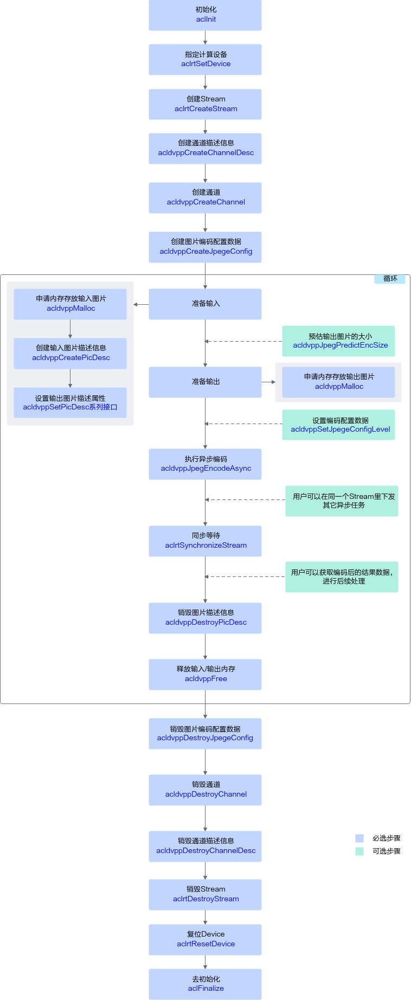

# JPEGE图片编码

本节介绍JPEGE图片编码的接口调用流程，同时配合示例代码辅助理解该接口调用流程。

JPEGE（JPEG Encoder）负责完成图像编码功能，将YUV格式图片编码成.jpg图片。关于JPEGE功能的详细介绍及使用约束请参见[《DVPP媒体加速库》](https://hiascend.com/document/redirect/CannCommunityDvppApi)。

## 接口调用流程

**图 1**  JPEG图片编码  


当前系统支持将YUV格式图片编码成.jpg图片，关键接口的说明如下：

1. 调用aclInit接口初始化系统。
2. 调用aclrtSetDevice接口指定计算设备。
3. 调用aclrtCreateStream接口创建Stream。
4. 调用acldvppCreateChannel接口**创建图片数据处理的通道**。

    创建图片数据处理的通道前，需先调用acldvppCreateChannelDesc接口创建通道描述信息。

5. 调用acldvppCreateJpegeConfig接口**创建图片编码配置数据**。
6. 实现JPEG图片编码功能前，若需要**申请Device上的内存**存放输入或输出数据，需调用acldvppMalloc申请内存。

    在申请输出内存前，可调用acldvppJpegPredictEncSize接口根据输入图片描述信息、图片编码配置数据可预估图片编码后所需的输出内存的大小。

    实际输出内存大小可能与调用acldvppJpegPredictEncSize接口预估的内存大小存在差异，如果用户需要获取编码后的实际输出内存大小，可通过acldvppJpegEncodeAsync接口的出参size获取。

7. 调用acldvppJpegEncodeAsync异步接口进行**编码**。

    对于异步接口，还需调用aclrtSynchronizeStream接口阻塞程序运行，直到指定Stream中的所有任务都完成。

8. 调用acldvppDestroyJpegeConfig接口**销毁图片编码配置数据**。
9. 在编码结束后，需及时调用acldvppFree接口**释放输入、输出内存**。
10. 调用acldvppDestroyChannel接口**销毁图片数据处理的通道**。

    销毁图片数据处理的通道后，再调用acldvppDestroyChannelDesc接口销毁通道描述信息。

11. 调用aclrtDestroyStream接口销毁Stream。
12. 调用aclrtResetDevice接口复位设备，释放Device上的资源。
13. 调用aclFinalize接口实现系统去初始化，用于释放进程内acl接口使用的相关资源。

## 示例代码

以下是JPEGE图片编码功能关键步骤的代码示例，不能直接拷贝编译运行，仅供参考。调用接口后，需增加异常处理的分支，并记录报错日志、提示日志，此处不一一列举。

您可以单击[vpc\_jpeg\_resnet50\_imagenet\_classification](https://gitee.com/ascend/samples/tree/master/cplusplus/level2_simple_inference/1_classification/vpc_jpeg_resnet50_imagenet_classification)获取样例。

```cpp
// 1. 创建图片数据处理通道时的通道描述信息，dvppChannelDesc_是acldvppChannelDesc类型
dvppChannelDesc_ = acldvppCreateChannelDesc();

// 2. 创建图片数据处理的通道
aclError ret = acldvppCreateChannel(dvppChannelDesc_);

// 3. 申请输入内存（区分运行状态）
// 调用aclrtGetRunMode接口获取软件栈的运行模式，如果调用aclrtGetRunMode接口获取软件栈的运行模式为ACL_HOST，则需要通过aclrtMemcpy接口将输入图片数据传输到Device，数据传输完成后，需及时释放内存；否则直接申请并使用Device的内存
aclrtRunMode runMode;
ret = aclrtGetRunMode(&runMode);
// inputPicWidth、inputPicHeight分别表示图片的对齐后宽、对齐后高，此处以YUV420SP格式的图片为例
uint32_t PicBufferSize = inputPicWidth * inputPicHeight * 3 / 2;
if(runMode == ACL_HOST){ 
    // 申请Host内存vpcInHostBuffer
    void* vpcInHostBuffer = nullptr;
    vpcInHostBuffer = malloc(PicBufferSize);
    // 将输入图片读入内存中，该自定义函数ReadPicFile由用户实现
    ReadPicFile(picName, vpcInHostBuffer, PicBufferSize);
    // 申请Device内存inDevBuffer_
    ret = acldvppMalloc(&inDevBuffer_, PicBufferSize);
    // 通过aclrtMemcpy接口将输入图片数据传输到Device
    ret = aclrtMemcpy(inDevBuffer_, PicBufferSize, vpcInHostBuffer, PicBufferSize, ACL_MEMCPY_HOST_TO_DEVICE);
    // 数据传输完成后，及时释放内存
    free(vpcInHostBuffer);
} else {
    // 申请Device输入内存inDevBuffer_
    ret = acldvppMalloc(&inDevBuffer_, PicBufferSize);
    // 将输入图片读入内存中，该自定义函数ReadPicFile由用户实现
    ReadPicFile(picName, inDevBuffer_, PicBufferSize);
}

// 4. 创建编码输入图片的描述信息，并设置各属性值
// encodeInputDesc_是acldvppPicDesc类型
encodeInputDesc_ = acldvppCreatePicDesc();
acldvppSetPicDescData(encodeInputDesc_, reinterpret_cast<void *>(inDevBuffer_));
acldvppSetPicDescFormat(encodeInputDesc_, PIXEL_FORMAT_YUV_SEMIPLANAR_420);
acldvppSetPicDescWidth(encodeInputDesc_, inputWidth_);
acldvppSetPicDescHeight(encodeInputDesc_, inputHeight_);
acldvppSetPicDescWidthStride(encodeInputDesc_, encodeInWidthStride);
acldvppSetPicDescHeightStride(encodeInputDesc_, encodeInHeightStride);
acldvppSetPicDescSize(encodeInputDesc_, inDevBufferSizeE_);

// 5. 创建图片编码配置数据，设置编码质量
// 编码质量范围[0, 100]，其中level 0编码质量与level 100差不多，而在[1, 100]内数值越小输出图片质量越差。
jpegeConfig_ = acldvppCreateJpegeConfig();
acldvppSetJpegeConfigLevel(jpegeConfig_, 100);

// 6. 申请输出内存，申请Device内存encodeOutBufferDev_,存放编码后的输出数据
uint32_t outBufferSize= 0;
ret = acldvppJpegPredictEncSize(encodeInputDesc_, jpegeConfig_, &outBufferSize);
ret = acldvppMalloc(&encodeOutBufferDev_, outBufferSize);

// 7. 执行异步编码，再调用aclrtSynchronizeStream接口阻塞程序运行，直到指定Stream中的所有任务都完成
ret = acldvppJpegEncodeAsync(dvppChannelDesc_, encodeInputDesc_, encodeOutBufferDev_,
            &outBufferSize, jpegeConfig_, stream_);
ret = aclrtSynchronizeStream(stream_);

// 8. 编码结束后，释放资源，包括编码输入/输出图片的描述信息、编码输入/输出内存、通道描述信息、通道等
acldvppDestroyPicDesc(encodeInputDesc_);

if(runMode == ACL_HOST){ 
    // 该模式下，由于处理结果在Device侧，因此需要调用内存复制接口传输结果数据后，再释放Device侧内存
    // 申请Host内存outputHostBuffer 
    void* outputHostBuffer = nullptr;
    outputHostBuffer = malloc(outBufferSize);
    // 通过aclrtMemcpy接口将Device的处理结果数据传输到Host
    ret = aclrtMemcpy(outputHostBuffer, outBufferSize, encodeOutBufferDev_, outBufferSize, ACL_MEMCPY_DEVICE_TO_HOST);
    // 释放掉输入输出的device内存
    (void)acldvppFree(inDevBuffer_);
    (void)acldvppFree(encodeOutBufferDev_);
    // 数据使用完成后，释放内存
    free(outputHostBuffer);
} else { 
    // 此时运行在device侧，处理结果也在Device侧，可以根据需要操作处理结果后，释放Device侧内存
    (void)acldvppFree(inDevBuffer_);
    (void)acldvppFree(encodeOutBufferDev_);
}
acldvppDestroyChannel(dvppChannelDesc_);
(void)acldvppDestroyChannelDesc(dvppChannelDesc_);
dvppChannelDesc_ = nullptr;

....
```
