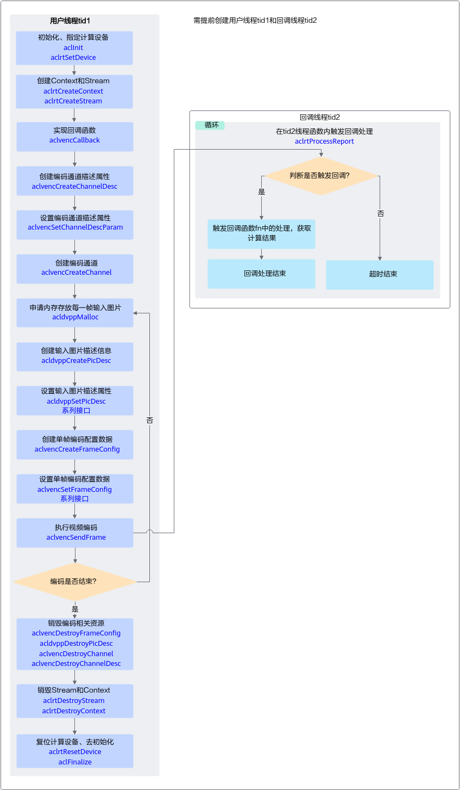

# VENC视频编码

本节介绍VENC视频编码的接口调用流程，同时配合示例代码辅助理解该接口调用流程。

VENC（Video Encoder）将YUV420SP格式的图片编码成H264/H265格式的视频码流。关于VENC功能的详细介绍及使用约束请参见[《DVPP媒体加速库》](https://hiascend.com/document/redirect/CannCommunityDvppApi)。

## 接口调用流程

**图 1**  视频编码流程  


实现视频的编码，关键接口的说明如下：

1. **调用aclvencCreateChannel接口创建视频编码处理的通道。**
    - 创建视频编码处理通道前，需先执行以下操作：
        1. 调用aclvencCreateChannelDesc接口**创建通道描述信息**。
        2. 调用aclvencSetChannelDescParam接口**设置通道描述信息的属性**，包括**线程、回调函数、视频编码协议、输入图片格式**等，其中：

            1. 回调函数需由用户提前创建，用于在视频编码后，获取编码数据，并及时释放相关资源，回调函数的原型请参见aclvencCallback。

                视频编码结束后，建议用户在回调函数内及时释放输入图片内存、以及相应的图片描述信息。视频编码的输出内存由系统管理，不由用户管理，因此无需用户释放。

            2. 线程需由用户提前创建，并自定义线程函数，在线程函数内调用aclrtProcessReport接口，等待指定时间后，触发前一步中的回调函数。

            >**说明：** 
            >推荐使用aclvencSetChannelDescParam接口设置通道描述信息的属性，通过枚举值来选择通过该接口设置某一个属性的值。
            >但为兼容旧版本，也可以调用aclvencSetChannelDesc系列接口设置通道描述信息的属性，每个属性的设置对应一个set接口。

    - aclvencCreateChannel接口内部封装了如下接口，无需用户单独调用：
        1. aclrtCreateStream接口：显式创建Stream，VENC内部使用。
        2. aclrtSubscribeReport接口：指定处理Stream上回调函数的线程，回调函数和线程是由用户调用aclvencSetChannelDescParam接口时指定的。

2. **调用aclvencSendFrame接口将YUV420SP格式的图片编码成H264/H265格式的视频码流。**
    - **视频编码前**，需先执行以下操作：
        - 调用acldvppCreatePicDesc接口创建输入图片描述信息，并调用acldvppSetPicDesc系列接口设置输入图片的内存地址、内存大小、图片格式等属性。
        - 调用aclvencCreateFrameConfig接口创建单帧编码配置数据，并调用aclvencSetFrameConfig系列接口设置是否强制重新开始I帧间隔、是否结束帧。

    - **视频编码时**，aclvencSendFrame接口内部封装了aclrtLaunchCallback接口，用于在Stream的任务队列中增加一个需要执行的回调函数。用户无需单独调用aclrtLaunchCallback接口。
    - **视频编码后**，视频编码的结果数据通过回调函数获取。

3. **调用aclvencDestroyChannel接口销毁视频处理的通道。**
    - 系统会等待已发送帧编码完成且用户的回调函数处理完成后再销毁通道。
    - aclvencDestroyChannel接口内部封装了如下接口，无需用户单独调用：
        - aclrtUnSubscribeReport接口：取消线程注册（Stream上的回调函数不再由指定线程处理）。
        - aclrtDestroyStream接口：销毁Stream。

    - 销毁通道后，需调用aclvencDestroyChannelDesc接口销毁通道描述信息。
    - 销毁通道描述信息后，用户才可以销毁第1步中创建的线程。

## 示例代码

以下是VENC视频编码功能关键步骤的代码示例，不能直接拷贝编译运行，仅供参考。调用接口后，需增加异常处理的分支，并记录报错日志、提示日志，此处不一一列举。

您可以单击[venc\_image](https://gitee.com/ascend/samples/tree/master/cplusplus/level2_simple_inference/0_data_process/venc_image)获取样例。

```cpp
// 1. 创建执行回调函数的线程及线程函数
static bool runFlag = true;
void *ThreadFunc(void *arg)
{
     // Notice: create context for this thread
    int deviceId = 0;
    aclrtContext context = nullptr;
    aclError ret = aclrtCreateContext(&context, deviceId);
    INFO_LOG("process callback thread start ");
    while (runFlag) {
        // Notice: timeout 1000ms
        (void)aclrtProcessReport(1000);
    }
    // ......
    ret = aclrtDestroyContext(context);
    return (void*)0;
}

int createThreadErr = pthread_create(&threadId_, nullptr, ThreadFunc, nullptr);

// 2. 创建回调函数
void callback(acldvppPicDesc *input, acldvppStreamDesc *outputStreamDesc, void *userdata)
{
    // 获取视频编码结果数据，并写入文件
    void *outputDev = acldvppGetStreamDescData(outputStreamDesc);
    uint32_t streamDescSize = acldvppGetStreamDescSize(outputStreamDesc);
    if (!Utils::WriteToFile(g_outFileFp, outputDev, streamDescSize)) {
        ERROR_LOG("write file:%s failed.", g_outFile.c_str());
    }
    INFO_LOG("callback success, stream size:%u", streamDescSize);
}

// 3. 创建视频编码处理通道时的通道描述信息，设置通道描述信息的属性，其中线程、callback回调函数需要用户提前创建
// vencChannelDesc_是aclvdecChannelDesc类型
vencChannelDesc_ = aclvencCreateChannelDesc();
aclError ret = aclvencSetChannelDescThreadId(vencChannelDesc_, threadId_);
ret = aclvencSetChannelDescCallback(vencChannelDesc_, callback);
ret = aclvencSetChannelDescEnType(vencChannelDesc_, enType_);
ret = aclvencSetChannelDescPicFormat(vencChannelDesc_, format_);
ret = aclvencSetChannelDescPicWidth(vencChannelDesc_, 128);
ret = aclvencSetChannelDescPicHeight(vencChannelDesc_, 128);
ret = aclvencSetChannelDescKeyFrameInterval(vencChannelDesc_, 16);

// 4. 创建视频码流处理的通道、单帧编码配置数据
ret = aclvencCreateChannel(vencChannelDesc_);
// vencFrameConfig_是aclvencFrameConfig类型
vencFrameConfig_ = aclvencCreateFrameConfig();

// 5. 申请Device内存dataDev，存放视频编码的输入数据
// 读入图片数据
const char *fileName = "../dvpp_venc_128x128_nv12.yuv";
FILE *fp = fopen(fileName, "rb+");
fseek(fp, 0, SEEK_END);
long fileLenLong = ftell(fp);
fseek(fp, 0, SEEK_SET);
auto fileLen = static_cast<uint32_t>(fileLenLong);
uint32_t dataSize = fileLen;

// 调用aclrtGetRunMode接口获取软件栈的运行模式，如果调用aclrtGetRunMode接口获取软件栈的运行模式为ACL_HOST，则需要通过aclrtMemcpy接口将输入图片数据传输到Device，数据传输完成后，需及时释放内存；否则直接申请并使用Device的内存
aclrtRunMode runMode;
ret = aclrtGetRunMode(&runMode);
if(runMode == ACL_HOST){ 
    void *dataHost = malloc(fileLen);
    size_t readSize = fread(dataHost, 1, fileLen, fp);
    void *dataDev = nullptr;
    ret = acldvppMalloc(&dataDev, dataSize);
    ret = aclrtMemcpy(dataDev, dataSize, dataHost, fileLen, ACL_MEMCPY_HOST_TO_DEVICE);
    // 完成数据传输后，需及时释放内存
    free(dataHost);
} 
else { 
    ret = acldvppMalloc(&dataDev, dataSize);
}

// 6. 执行视频编码
size_t g_vencCnt = 16;
// 6.1 创建输入图片描述信息，设置输入图片数据的内存地址和内存大小
inputPicputDesc_ = acldvppCreatePicDesc();
ret = acldvppSetPicDescData(inputPicputDesc_, dataDev);
ret = acldvppSetPicDescSize(inputPicputDesc_, dataSize);
// 6.2 设置单帧编码配置数据，不是结束帧
ret = aclvencSetFrameConfigEos(vencFrameConfig_, 0);
ret = aclvencSetFrameConfigForceIFrame(vencFrameConfig_, 0);
// 6.3 创建输出码流描述信息
acldvppStreamDesc *outputStreamDesc = nullptr;
// 6.4 执行视频编码
while (g_vencCnt > 0) {
        ret = aclvencSendFrame(vencChannelDesc_, inputPicputDesc_,
            static_cast<void *>(outputStreamDesc), vencFrameConfig_, nullptr);
        g_vencCnt--;
    }
// 6.5 设置单帧编码配置数据，是结束帧
ret = aclvencSetFrameConfigEos(vencFrameConfig_, 1);
ret = aclvencSetFrameConfigForceIFrame(vencFrameConfig_, 0);
// 6.6 执行最后一帧的视频编码
ret = aclvencSendFrame(vencChannelDesc_, nullptr, nullptr, vencFrameConfig_, nullptr);

// 7. 释放资源
(void)aclvencDestroyChannel(vencChannelDesc_);
(void)aclvencDestroyChannelDesc(vencChannelDesc_);
(void)acldvppDestroyPicDesc(inputPicputDesc_);
(void)aclvencDestroyFrameConfig(vencFrameConfig_);
// 释放内存和销毁线程
(void)acldvppFree(inBufferDev_);
void *res = nullptr;
int joinThreadErr = pthread_join(threadId_, &res);

......
```

如果调用aclvencSetChannelDescParam接口设置通道描述信息的属性，调用aclvencGetChannelDescParam接口获取通道描述信息中的属性值，示例代码如下：

```cpp
// 设置回调函数
void *func = (void *)callback;
aclvencSetChannelDescParam(vencChannelDesc_, ACL_VENC_CALLBACK_PTR, 8, &func);
// 获取回调函数
void *func1 = nullptr;
aclvencGetChannelDescParam(vencChannelDesc_, ACL_VENC_CALLBACK_PTR, 8, &len, &func1);

// 设置输入图片格式
acldvppPixelFormat format = PIXEL_FORMAT_YUV_SEMIPLANAR_420;
aclvencSetChannelDescParam(vencChannelDesc_, ACL_VENC_PIXEL_FORMAT_UINT32, 4, &format);
// 获取输入图片格式
acldvppPixelFormat format1 = PIXEL_FORMAT_YUV_SEMIPLANAR_420;
aclvencGetChannelDescParam(vencChannelDesc_, ACL_VENC_PIXEL_FORMAT_UINT32, 4, &len, &format1);

// 设置图片宽度
uint32_t width = 128;
aclvencSetChannelDescParam(vencChannelDesc_, ACL_VENC_PIC_WIDTH_UINT32, 4, &width);
// 获取图片宽度
uint32_t width1 = 0;
aclvencGetChannelDescParam(vencChannelDesc_, ACL_VENC_PIC_WIDTH_UINT32, 4, &len, &width1);

// 设置图片高度
uint32_t height = 128;
aclvencSetChannelDescParam(vencChannelDesc_, ACL_VENC_PIC_HEIGHT_UINT32, 4, &height);
// 获取图片高度
uint32_t height1 = 0;
aclvencGetChannelDescParam(vencChannelDesc_, ACL_VENC_PIC_HEIGHT_UINT32, 4, &len, &height1);

// 设置编码输出缓存地址
ret = acldvppMalloc(&buf, bufSize);
aclvencSetChannelDescParam(vencChannelDesc_, ACL_VENC_BUF_ADDR_PTR, 8, &buf);
// 获取编码输出缓存地址
void *buf1 = nullptr;
aclvencGetChannelDescParam(vencChannelDesc_, ACL_VENC_BUF_ADDR_PTR, 8, &len, &buf1);

```
