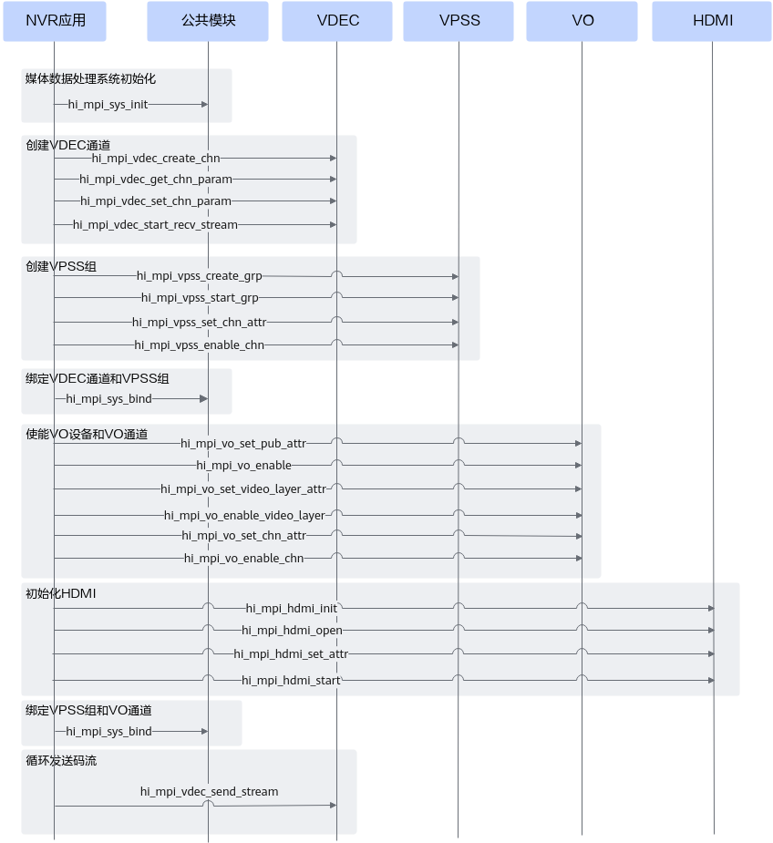
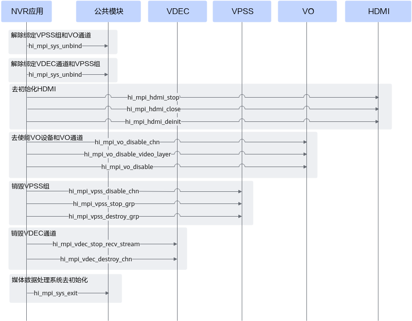
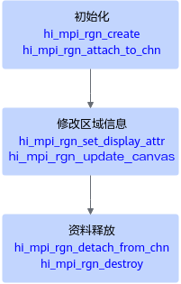
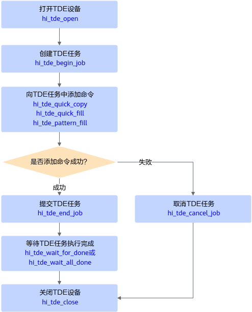

# NVR场景视频解码、处理和显示

本节介绍NVR视频业务处理的典型流程、关键接口及注意事项。

NVR，全称Network Video Recorder，即网络视频录像机，是网络视频系统的存储转发部分，NVR与网络摄像机协同工作，完成音频&视频的录像、存储及转发功能，同时，NVR具备本地人机交互界面、视频解码、视频显示及语音对讲功能。

## NVR视频场景说明

**本章节描述NVR视频业务处理流程，包括下面两种：**

1. **[视频解码显示流程](#section4761182923310)**

    视频解码显示流程涉及视频解码模块\(VDEC\)、视频处理模块\(VPSS\)、视频输出模块\(VO\)、HDMI接口模块, 以及增强的功能，例如[Region区域管理功能](NVR_video_decoding_processing_displaying.md#section13836172315012)、[TDE图形绘制功能](NVR_video_decoding_processing_displaying.md#section107971821203)、[HIFB叠加图形层管理功能](NVR_video_decoding_processing_displaying.md#section53701215202019)。

    在该流程中，通过调用hi\_mpi\_sys\_bind接口将VDEC通道与VPSS组绑定、将VPSS组与VO设备绑定，实现数据从VDEC到VPSS、从VPSS到VO的自动传输。通过底层寄存器，实现VO自动读取HIFB的输出数据。

    若TDE、HIFB与VO不在一个应用进程中，则需要确保先启动VO所在的进程，且TDE和HIFB所在的进程中也需要调用hi\_mpi\_sys\_init接口初始化媒体数据处理系统、并在进程退出前调用hi\_mpi\_sys\_exit接口实现媒体数据处理系统去初始化。

2. **[视频解码智能分析流程](#section14704382225)**

    视频解码智能分析流程涉及视频解码模块\(VDEC\)、视频处理模块\(VPSS\)、智能分析（模型推理）, 以及增强的功能，例如Region区域管理模块。区域管理功能的接口调用流程请参见[Region区域管理功能](NVR_video_decoding_processing_displaying.md#section13836172315012)。

## 视频解码显示流程

视频解码显示流程涉及视频解码模块\(VDEC\)、视频处理模块\(VPSS\)、视频输出模块\(VO\)、HDMI接口模块, 以及增强的功能，例如[Region区域管理功能](#section13836172315012)、[TDE图形绘制功能](#section107971821203)、[HIFB叠加图形层管理功能](#section53701215202019)

**图 1** **业务启动、运行接口调用流程**  

NVR视频解码显示业务启动、运行接口调用流程说明如下：

1. 调用hi\_mpi\_sys\_init接口完成**媒体系统初始化**。
2. **创建VDEC视频解码通道**（按需创建多个通道），并通知解码器启动接收码流。
    1. 调用hi\_mpi\_vdec\_create\_chn接口创建通道。
    2. 调用hi\_mpi\_vdec\_get\_chn\_param接口获取通道属性、按需设置通道属性后，调用hi\_mpi\_vdec\_set\_chn\_param接口设置通道参数。
    3. 解码前，需调用hi\_mpi\_vdec\_start\_recv\_stream接口通知解码器启动接收码流。

3. **创建并启用VPSS组**（按需创建多个VPSS组）。
    1. 调用hi\_mpi\_vpss\_create\_grp接口创建VPSS组
    2. 调用hi\_mpi\_vpss\_start\_grp接口启用VPSS组。
    3. 调用hi\_mpi\_vpss\_set\_chn\_attr接口设置通道属性，在和VO模块配合工作时，通道属性需要设置为Auto模式。
    4. 调用hi\_mpi\_vpss\_enable\_chn接口启动VPSS通道。

   

4. 调用hi\_mpi\_sys\_bind接口**绑定视频解码通道和VPSS组**，经过VDEC视频解码的输出数据直接被送入对应的VPSS组继续处理。
以单个显示器输出4路视频显示为例，绑定信息如下表所示：

   | VDEC通道 | VPSS Group | VO通道 | VO视频层 | VO设备号 | HDMI编号 |
   | --- | --- | --- | --- | --- | --- |
   | 1 | 1 | 1 | VHD0 | 0 | HDMI0 |
   | 2 | 2 | 2 | VHD0 | 0 | HDMI0 |
   | 3 | 3 | 3 | VHD0 | 0 | HDMI0 |
   | 4 | 4 | 4 | VHD0 | 0 | HDMI0 |

   以两个显示器输出、每个显示器输出4路视频显示为例，绑定信息如下表所示:

   | VDEC通道 | VPSS Group | VO通道 | VO视频层 | VO设备号 | HDMI编号 |
   | --- | --- | --- | --- | --- | --- |
   | 1 | 1 | 1 | VHD0 | 0 | HDMI0 |
   | 2 | 2 | 2 | VHD0 | 0 | HDMI0 |
   | 3 | 3 | 3 | VHD0 | 0 | HDMI0 |
   | 4 | 4 | 4 | VHD0 | 0 | HDMI0 |
   | 5 | 5 | 5 | VHD1 | 1 | HDMI1 |
   | 6 | 6 | 6 | VHD1 | 1 | HDMI1 |
   | 7 | 7 | 7 | VHD1 | 1 | HDMI1 |
   | 8 | 8 | 8 | VHD1 | 1 | HDMI1 |

5. **启用VO设备和VO通道**（按需创建多个VO通道）。
    1. 调用hi\_mpi\_vo\_set\_pub\_attr配置显示设备属性，通过hi\_mpi\_vo\_enable启用显示设备。
    2. 调用hi\_mpi\_vo\_set\_video\_layer\_attr配置显示视频层属性，通过hi\_mpi\_vo\_enable\_video\_layer启用显示视频层。
    3. 调用hi\_mpi\_vo\_set\_chn\_attr配置显示通道属性，通过hi\_mpi\_vo\_enable\_chn启用显示通道。

6. **初始化HDMI外设**。
    1. 调用hi\_mpi\_hdmi\_init初始化HDMI设备，调用hi\_mpi\_hdmi\_open打开HDMI。
    2. 调用hi\_mpi\_hdmi\_set\_attr配置HDMI属性。
    3. 调用hi\_mpi\_hdmi\_start启动HDMI外设，以便显示视频。

7. 调用hi\_mpi\_sys\_bind接口**绑定VPSS组和VO通道**，经过VPSS处理后的输出数据直接被送入对应的VO通道继续处理。

    绑定信息请参见[4](#li178971210115019)。

8. 循环调用hi\_mpi\_vdec\_send\_stream接口，**发送每一帧解码码流**。

    **注意：**

    1. 在视频解码通道和VPSS组绑定后，用户调用hi\_mpi\_vdec\_send\_stream发送码流时，接口参数中的vdec\_pic\_info可以设置为NULL, 此时的视频解码通道和VPSS模块绑定（参见[4](#li178971210115019)），解码结果数据直接被送入对应的VPSS组继续处理，不支持通过hi\_mpi\_vdec\_get\_frame接口获取解码结果数据。
    2. 视频解码支持两种模式，即回放模式和预览模式，可以通过hi\_mpi\_vdec\_get\_display\_mode和hi\_mpi\_vdec\_set\_display\_mode接口进行查询和设置，对于录像播放需要使用回放模式，此时支持播放控制。

 

**图 2** **资源释放接口调用流程**  

NVR视频解码显示业务资源释放接口调用流程说明如下：

1. 调用hi\_mpi\_sys\_unbind接口**取消VO通道与VPSS组的绑定**。
2. 调用hi\_mpi\_sys\_unbind接口**取消VPSS组与VDEC通道的绑定**。
3. **释放HDMI外设资源**。
    1. 首先调用hi\_mpi\_hdmi\_stop停止HDMI。
    2. 调用hi\_mpi\_hdmi\_close关闭HDMI。
    3. 调用hi\_mpi\_hdmi\_deinit去初始化HDMI设备。

4. **释放VO设备、通道资源**。
    1. 调用hi\_mpi\_vo\_disable\_chn禁用通道。
    2. 调用hi\_mpi\_vo\_disable\_video\_layer禁用视频层。
    3. 调用hi\_mpi\_vo\_disable禁用显示设备。

5. **销毁VPSS组**。
    1. 调用hi\_mpi\_vpss\_disable\_chn接口关闭VPSS通道。
    2. 调用hi\_mpi\_vpss\_stop\_grp接口停止VPSS组。
    3. 调用hi\_mpi\_vpss\_destroy\_grp接口销毁VPSS组。

6. **销毁VDEC视频解码通道**。
    1. 调用hi\_mpi\_vdec\_stop\_recv\_stream接口通知解码器停止接收码流。
    2. 调用hi\_mpi\_vdec\_destroy\_chn接口销毁通道。

7. 调用hi\_mpi\_sys\_exit接口完成**媒体数据处理系统去初始化**。

## 视频解码智能分析流程

视频解码智能分析流程涉及视频解码模块\(VDEC\)、视频处理模块\(VPSS\)、智能分析（模型推理）, 以及增强的功能，例如Region区域管理模块。区域管理功能的接口调用流程请参见[Region区域管理功能](#section13836172315012)。

**图 3** **业务启动、运行接口调用流程**  

视频解码智能分析业务启动、运行流程：

1. 调用hi\_mpi\_sys\_init接口完成**媒体系统初始化**。
2. **创建VDEC视频解码通道**（按需创建多个通道），并通知解码器启动接收码流。
    1. 调用hi\_mpi\_vdec\_create\_chn接口创建通道。
    2. 调用hi\_mpi\_vdec\_get\_chn\_param接口获取通道属性、按需设置通道属性后，调用hi\_mpi\_vdec\_set\_chn\_param接口设置通道参数。
    3. 解码前，需调用hi\_mpi\_vdec\_start\_recv\_stream接口通知解码器启动接收码流。

3. **创建并启用VPSS组**（按需创建多个VPSS组）。
    1. 调用hi\_mpi\_vpss\_create\_grp接口创建VPSS组
    2. 调用hi\_mpi\_vpss\_start\_grp接口启用VPSS组。
    3. 调用hi\_mpi\_vpss\_set\_chn\_attr接口设置通道属性，通道属性需要设置为User模式。
    4. 调用hi\_mpi\_vpss\_enable\_chn接口启动VPSS通道。

4. 调用hi\_mpi\_sys\_bind接口**绑定视频解码通道和VPSS组**，经过VDEC视频解码的输出数据直接被送入对应的VPSS组继续处理。

    绑定信息请参见[4](#li178971210115019)。

5. 循环调用hi\_mpi\_vdec\_send\_stream接口，**发送每一帧解码码流**。

    **注意：**

    在视频解码通道和VPSS组绑定后，用户调用hi\_mpi\_vdec\_send\_stream发送码流时，接口参数中的vdec\_pic\_info可以设置为NULL, 此时的视频解码通道和VPSS模块绑定（参见[4](#li178971210115019)），解码结果数据直接被送入对应的VPSS组继续处理，不支持通过hi\_mpi\_vdec\_get\_frame接口获取解码结果数据。

6. 调用hi\_mpi\_vpss\_get\_chn\_frame接口**获取VPSS处理后的图像数据**，可送入模型推理，推理结束后，最后调用hi\_mpi\_vpss\_release\_chn\_frame**释放一帧通道图像**。

    **注意**：

    在多通道时，用户可调用hi\_mpi\_vpss\_get\_chn\_fd接口获取VPSS指定通道的句柄，并通过调用epoll接口（参考hi\_mpi\_sys\_create\_epoll相关接口）等待VPSS处理结果。VPSS处理完后，会自动唤醒epoll等待，此时可调用hi\_mpi\_vpss\_get\_chn\_frame接口获取VPSS处理后的图像数据。

    VPSS处理后的图像，在送入模型推理前，若图片尺寸、格式等不满足要求，需要经过DVPP的VPC功能模块、AIPP功能进一步处理，请参见[媒体数据处理功能简介](DVPP_overview.md)中关于VPC、AIPP的介绍。

**图 4** **资源释放接口调用流程**  

NVR视频解码智能分析业务资源释放接口调用流程说明如下：

1. 调用hi\_mpi\_sys\_unbind接口**取消VPSS组与VDEC通道的绑定**。
2. **销毁VPSS组**。
    1. 调用hi\_mpi\_vpss\_disable\_chn接口关闭VPSS通道。
    2. 调用hi\_mpi\_vpss\_stop\_grp接口停止VPSS组。
    3. 调用hi\_mpi\_vpss\_destroy\_grp接口销毁VPSS组。

3. **销毁VDEC视频解码通**道。
    1. 调用hi\_mpi\_vdec\_stop\_recv\_stream接口通知解码器停止接收码流。
    2. 调用hi\_mpi\_vdec\_destroy\_chn接口销毁通道。

4. 调用hi\_mpi\_sys\_exit接口完成**媒体数据处理系统去初始化**。

## Region区域管理功能

叠加在视频上的OSD \(On Screen Display\)和遮挡在视频上的色块统称为区域。**区域管理模块**，用于统一管理这些区域资源，用于在视频上显示一些特定信息（如通道号、时间戳等）、或在视频中填充色块用于遮挡。

区域管理功能（Region）必须配合VPSS模块一起使用，且区域管理功能需关联的VPSS组、VPSS通道已创建，接口调用流程如下所示。

1. **初始化**：
    1. 调用hi\_mpi\_rgn\_create创建区域。
    2. 调用hi\_mpi\_rgn\_attach\_to\_chn接口将区域叠加到VPSS通道上。

2. **按需修改区域信息**：
    - 设置区域通道显示属性：
        1. 调用hi\_mpi\_rgn\_get\_display\_attr接口获取区域当前的通道显示属性。
        2. 调用hi\_mpi\_rgn\_set\_display\_attr接口设置区域的通道显示属性。

    - 设置区域的显示画布信息：
        1. 调用hi\_mpi\_rgn\_get\_canvas\_info接口获取当前区域的显示画布信息。
        2. 调用hi\_mpi\_rgn\_update\_canvas接口更新显示画布信息。

3. **资源释放**：
    1. 调用hi\_mpi\_rgn\_detach\_from\_chn接口将指定区域从VPSS通道中删除。
    2. 调用hi\_mpi\_rgn\_destroy接口销毁区域。

## TDE图形绘制功能

TDE是图形二维加速引擎，它利用硬件为OSD（On Screen Display）和GUI（Graphical User Interface）提供快速的图形绘制功能，主要有快速拷贝、快速色彩填充、模式填充（当前仅支持Alpha Blending操作）。

**图 5** **TDE接口调用流程**  

1. 调用hi\_tde\_open接口**打开TDE设备**。
2. 调用hi\_tde\_begin\_job接口**创建TDE任务**。
3. 调用各**命令执行**接口，例如hi\_tde\_quick\_copy、hi\_tde\_quick\_fill、hi\_tde\_pattern\_fill。

    调用命令执行接口前，需先调用HIFB提供的**int ioctl \(int fd,  FBIOGET\_FSCREENINFO,  fb\_fix\_screeninfo \*fix\)**接口获取显存用户态地址，作为目标位图的内存地址，TDE任务执行完成后，目标位图的数据会存放在该内存地址中，作为HIFB的输入数据。

4. 若添加命令失败，则调用hi\_tde\_cancel\_job接口取消任务；若添加命令成功，则调用hi\_tde\_end\_job接口提交任务。
5. **等待TDE任务完成**。

    目前有等待指定TDE任务执行完成（调用hi\_tde\_wait\_for\_done接口）、等待当前TDE设备上所有任务执行完成（调用hi\_tde\_wait\_all\_done接口）两种方式。

## HIFB叠加图形层管理功能

HIFB用于管理叠加图形层，它不仅提供Linux Framebuffer的基本功能，还在Linux Framebuffer的基础上增加图层显示起始位置修改、层间Alpha等扩展功能。

**图 6**  HIFB接口调用流程  

1. 通过系统调用open**打开fb设备**。设备文件fb0\~fb4对应图层G0\~G4。其中，G0和G1为高清图层、G2为鼠标图层、G3和G4为标清图层。

    各图层对应的fb设备、VO设备、支持的颜色格式、分辨率等说明，请参见[《DVPP媒体加速库》](https://hiascend.com/document/redirect/CannCommunityDvppApi)中HIFB叠加图形层管理功能的说明。

2. 通过系统调用ioctl，传入命令码FBIOGET\_VSCREENINFO**获取屏幕基本属性**。
3. 通过系统调用ioctl，传入命令码FBIOPUT\_VSCREENINFO**设置屏幕基本属性**。
4. 通过系统调用ioctl，传入命令码FBIOGET\_FSCREENINFO**获取显存用户态地址**。
5. 通过系统调用mmap**映射用户态虚拟地址**。
6. 通过系统调用ioctl，传入功能相关的命令码**设置功能属性**。
7. 通过系统调用munmap**解除用户态虚拟地址映射**。
8. 通过系统调用close**关闭fb设备**。

    如果HIFB与VO在同一个进程中配合使用，则需要在禁用VO设备（即调用hi\_mpi\_vo\_disable）后关闭fb设备。

    如果HIFB与VO不在同一个进程中，则需要先停VO所在的应用进程。
