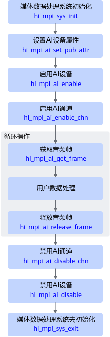

# 音频获取&音频播放

本节介绍音频获取、音频播放功能的接口调用流程及注意事项。

## 音频获取功能

1. 调用hi\_mpi\_sys\_init接口初始化媒体公共模块。
2. 调用hi\_mpi\_ai\_set\_pub\_attr接口配置属性。
3. 依次调用hi\_mpi\_ai\_enable接口启用AI设备、调用hi\_mpi\_ai\_enable\_chn接口启用AI通道。
4. 调用hi\_mpi\_ai\_get\_frame获取录音数据进行处理，之后调用hi\_mpi\_ai\_release\_frame释放音频帧，循环往复。
5. AI采集音频结束时，先调用hi\_mpi\_ai\_disable\_chn接口禁用通道，然后调用hi\_mpi\_ai\_disable接口禁用AI设备。
6. 调用hi\_mpi\_sys\_exit接口释放媒体公共模块的初始化资源。

## 音频播放功能

1. 调用hi\_mpi\_sys\_init接口初始化媒体公共模块。
2. 调用hi\_mpi\_ao\_set\_pub\_attr接口配置属性。
3. 依次调用hi\_mpi\_ao\_enable接口启用AO设备、调用hi\_mpi\_ao\_enable\_chn接口启用AO通道。
4. 周期性的获取数据，并调用hi\_mpi\_ao\_send\_frame接口进行播音。
5. AO播放音频结束时，先调用hi\_mpi\_ao\_get\_chn\_delay接口获取AO通道中当前音频延时大小，延时为0后再调用hi\_mpi\_ao\_disable\_chn接口禁用通道，然后调用hi\_mpi\_ao\_disable接口禁用AO设备。
6. 调用hi\_mpi\_sys\_exit接口释放媒体公共模块的初始化资源。
