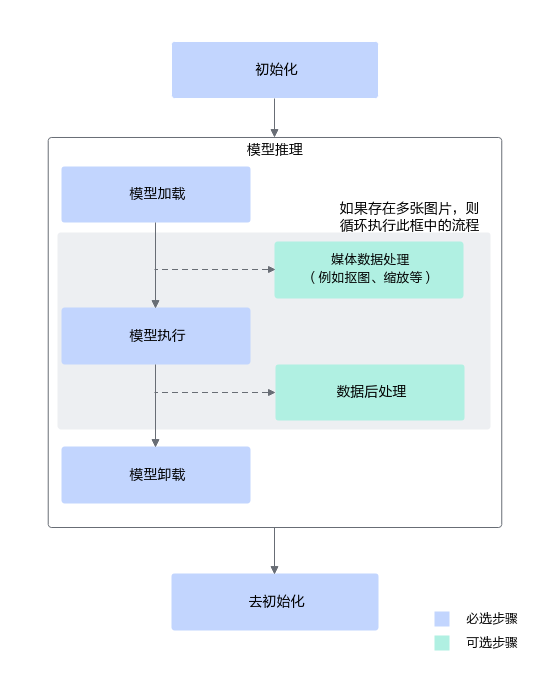

# 模型推理简介

本章中的模型是指基于CANN图引擎（Graph Engine, 简称GE）将训练好的开源框架网络模型编译生成的om模型。GE在编译模型时会执行图优化、算子调度优化和权重数据重排等操作，以进一步调优开源框架的网络模型，满足部署场景下的高性能需求，确保其在AI处理器上高效运行。

GE提供了以下两种模型编译方式：

- 使用昇腾张量编译器（Ascend Tensor Compiler，简称ATC）将训练好的开源框架网络模型编译为OM模型文件。对于新手而言，使用ATC命令较为适宜，本章也将以此为例介绍如何编译模型。
- 使用图开发接口训练好的开源框架网络模型转换为采用Ascend IR（Ascend Intermediate Representation）表示的计算图（Ascend Graph）。详细描述请参见[《图开发》](https://hiascend.com/document/redirect/CannCommunityGraphguide)。

编译出om模型之后，再基于GE提供的模型加载与执行接口实现模型推理。接口调用流程如下图所示：

**图 1**  接口调用流程图  

关键接口说明如下：

1. 初始化包括调用aclInit接口进行初始化系统、调用aclrtSetDevice接口指定计算设备。

    使用acl接口开发应用时，必须先调用aclInit接口进行初始化，否则可能会导致后续系统内部资源初始化出错，进而导致其它业务异常。

2. 调用模型加载接口（例如aclmdlLoadFromFile）加载om模型，加载成功返回模型ID。
3. 调用模型执行接口（例如aclmdlExecute）、指定模型ID，进行推理。

    若使用异步模型执行接口（例如aclmdlExecuteAsync），在执行模型前，还需要调用aclrtCreateStream接口创建Stream， Stream相当于一个任务队列，确保任务按照进入队列的顺序依次执行；执行模型后，需调用aclrtSynchronizeStream接口等待Stream中的任务都执行完成。Stream使用完成后，还需调用aclrtDestroyStream接口销毁Stream。

4. 调用aclmdlUnload接口卸载模型。
5. 去初始化包括调用aclrtResetDevice接口释放Device上的资源、调用aclFinalize接口释放进程内acl接口使用的相关资源。
