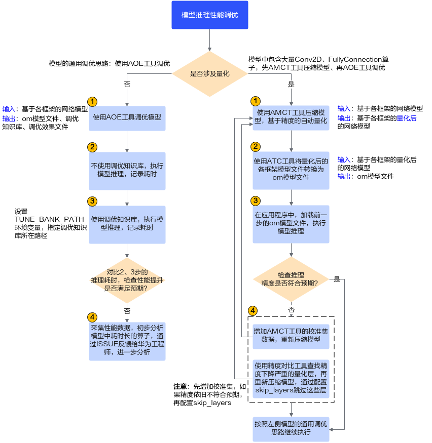

# 模型推理性能调优思路

在整网推理时，可能由于模型在AI处理器上的算子适配、数据读写等问题，导致模型推理的性能不符合预期，您可以查阅本节介绍的内容，了解模型推理时的性能调优流程。由于是调优，因此在调优前，请确保已经完成了整网推理功能调测，功能不阻塞，只是模型推理性能不符合预期、待提升。

在下图的性能调优流程中，涉及调优的关键工具为：模型调优工具AOE（Ascend Optimization Engine）、模型压缩工具AMCT（Ascend Model Compression Toolkit）。在调优过程中，涉及转换模型、记录模型推理耗时、分析性能瓶颈点等操作时，还会辅助使用模型转换工具ATC、性能数据采集工具、精度比对工具。

