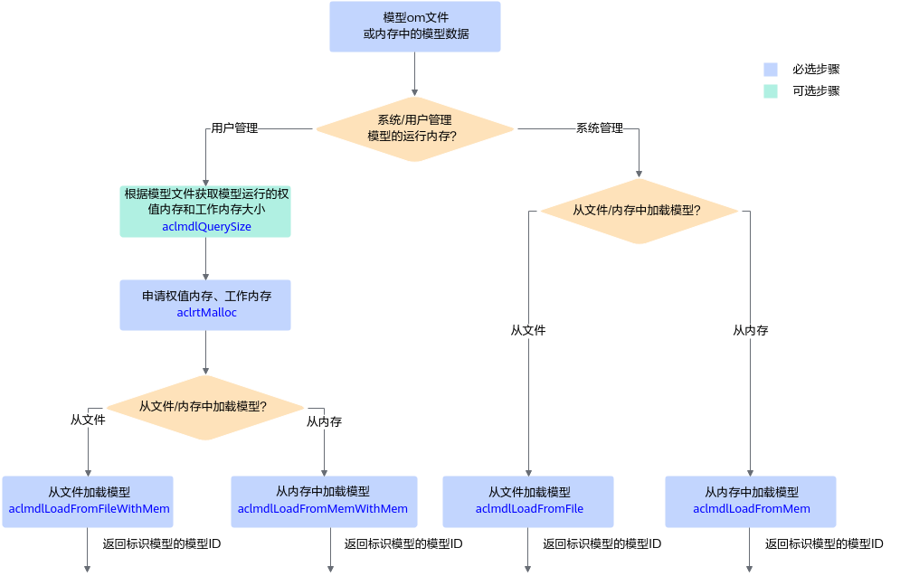

# 模型加载

本节描述的是**整网模型加载**的接口调用流程。

## 接口调用流程

当前存在**两套模型加载的acl接口**，用户可根据编程习惯、使用场景选择对应的模型加载接口：

- 如图1所示，针对不同的加载方式（从文件加载、从内存加载等），只需**设置接口中的配置参数**，适用各种加载方式，但涉及**多个接口配合使用**，分别用于创建配置对象、设置对象中的属性值、加载模型。
- 如图2所示，根据不同的加载方式（从文件加载、从内存加载等）**选择不同的接口**，操作相对简单，但需要**记住各种方式的加载接口**。

    **图 1**  模型加载流程（通过接口中的配置参数区分加载方式）  
    

    **图 2**  模型加载流程（通过不同接口区分加载方式）  
    

关键接口的说明如下：

- **在模型加载前**，需要先**构建**出适配AI处理器的离线模型（**\*.om文件**），构建方式请参见[模型编译](model_build.md)。
- 当由用户管理内存时，为确保内存不浪费，在申请工作内存、权值内存前，需要调用aclmdlQuerySize接口**查询**模型运行时所需**工作内存**、**权值内存的大小**。

    如果模型输入数据的Shape不确定，则不能调用aclmdlQuerySize接口查询内存大小，在加载模型时，就无法由用户管理内存，因此需选择由系统管理内存的模型加载接口（例如aclmdlLoadFromFile）。

    若在构建模型时，调用构图接口自行构建自己的网络，且没有生成om离线模型文件、只是将模型数据存放在内存中，则无法通过aclmdlQuerySize接口查询内存大小。关于构图接口的详细说明请参见[《图开发》](https://hiascend.com/document/redirect/CannCommunityGraphguide)。

- 支持以下方式**加载模型**，模型加载成功后，返回标识模型的模型ID：
    - 使用aclmdlSetConfigOpt接口、aclmdlLoadWithConfig接口时，是通过配置对象中的属性来区分，在加载模型时是从文件加载，还是从内存加载，以及内存是由系统内部管理，还是由用户管理。
    - 使用以下接口时，是从使用的接口上区分从文件加载，还是从内存加载，以及内存是由系统内部管理，还是由用户管理。
        - aclmdlLoadFromFile：从文件加载离线模型数据，由系统内部管理内存。
        - aclmdlLoadFromMem：从内存加载离线模型数据，由系统内部管理模型运行的内存。
        - aclmdlLoadFromFileWithMem：从文件加载离线模型数据，由用户自行管理模型运行的内存（包括工作内存和权值内存，工作内存用于模型执行过程中的临时数据，权值内存用于存放权值数据）。
        - aclmdlLoadFromMemWithMem：从内存加载离线模型数据，由用户自行管理模型运行的内存（包括工作内存和权值内存）。

## 示例代码

此处以从文件加载模型、由用户自行管理内存为例。模型加载成功，会返回标识模型的ID，在[模型执行](model_execute.md)时需要使用该ID。

以下是关键步骤的代码示例，不能直接拷贝编译运行，仅供参考。调用接口后，需增加异常处理的分支，并记录报错日志、提示日志，此处不一一列举。

<!-- npu="950,A3,910b,910,310p,310b" id1 -->
您可以单击[resnet50\_imagenet\_classification](https://gitcode.com/cann/ge/tree/master/examples/acl/1_sample_resnet50_imagenet_classification)获取样例。
<!-- end id1 -->

```cpp
// 1. 初始化变量。
// 此处的..表示相对路径，相对可执行文件所在的目录
// 例如，编译出来的可执行文件存放在out目录下，此处的..就表示out目录的上一级目录
const char* omModelPath = "../model/resnet50.om";
// ......

// 2. 根据模型文件获取模型执行时所需的权值内存大小、工作内存大小。
aclError ret = aclmdlQuerySize(omModelPath, &modelMemSize_, &modelWeightSize_);

// 3. 根据工作内存大小，申请Device上模型执行的工作内存。
ret = aclrtMalloc(&modelMemPtr_, modelMemSize_, ACL_MEM_MALLOC_HUGE_FIRST);

// 4. 根据权值内存的大小，申请Device上模型执行的权值内存。
ret = aclrtMalloc(&modelWeightPtr_, modelWeightSize_, ACL_MEM_MALLOC_HUGE_FIRST);

// 5. 加载离线模型文件，由用户自行管理模型运行的内存(包括权值内存、工作内存)。
// 模型加载成功，返回标识模型的ID。
ret = aclmdlLoadFromFileWithMem(omModelPath, &modelId_, modelMemPtr_, modelMemSize_, modelWeightPtr_, modelWeightSize_);

// ......
```
