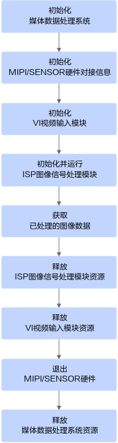
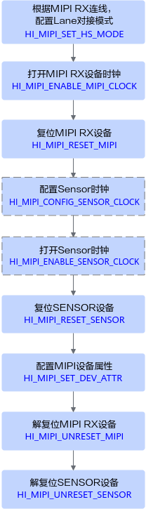
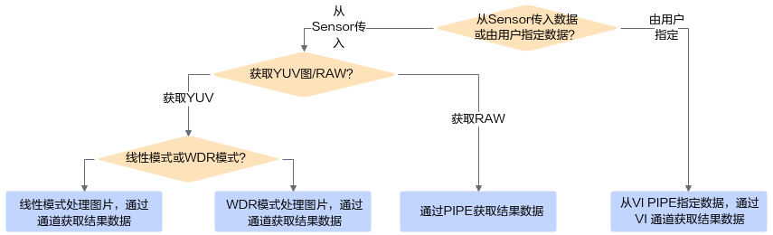
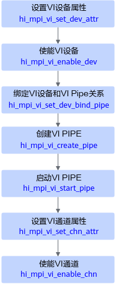
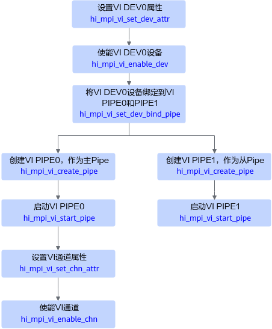
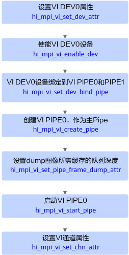
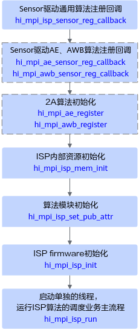
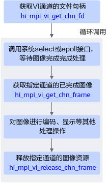

# 视频数据获取功能

视频获取功能需要ISP、MIPI Rx、VI等多个功能模块配合才能实现，本节介绍视频数据获取功能的总体接口调用流程、各功能模块的接口调用流程及注意事项。

当前需通过以下功能模块的配合实现视频数据获取功能：

- **ISP系统控制**

    系统控制部分用于注册3A算法、注册Sensor驱动、初始化ISP firmware、运行ISP firmware、退出ISP firmware、配置ISP属性等功能。

- **MIPI Rx ioctl命令字**

    MIPI Rx是一个支持多种差分视频输入接口的采集单元，通过combo-PHY接收MIPI/LVDS/sub-LVDS/HiSPi接口的数据，通过不同的功能模式配置，MIPI Rx可以支持多种速度和分辨率的数据传输需求，支持多种外部输入设备。

- **VI（Video Input）**

    VI模块捕获视频图像，可对其做裁剪、颜色优化、亮度优化、噪声去除等处理，并输出YUV或RAW格式的图像数据。

## 总体接口调用流程

接口调用流程说明如下：

1. 调用hi\_mpi\_sys\_init接口初始化媒体数据处理系统。
2. 使用MIPI Rx ioctl命令字初始化MIPI/Sensor硬件对接信息，接口调用流程请参见[初始化MIPI/Sensor硬件对接信息](#section5234939161715)。
3. 使用VI（Video Input）功能接口初始化VI模块，接口调用流程请参见[初始化VI视频输入模块](#section140011491810)。
4. 使用ISP（Image Signal Processing）系统控制接口初始化并运行ISP模块，接口调用流程请参见[初始化并运行ISP图像信号处理模块](#section0926122591813)。
5. 使用VI功能接口获取已处理的图像数据，接口调用流程请参见[获取已处理的图像数据](#section13127438161814)。
6. 使用ISP功能接口释放ISP模块资源，接口调用流程请参见[释放ISP图像信号处理模块资源](#section053155901816)。
7. 使用VI功能接口释放VI模块资源，接口调用流程请参见[释放VI视频输入模块资源](#section1909173011193)。
8. 使用MIPI Rx ioctl命令字退出MIPI/Sensor硬件，接口调用流程请参见[退出MIPI/Sensor硬件](#section440174412194)。
9. 调用hi\_mpi\_sys\_exit接口释放媒体数据处理系统资源。

## 初始化MIPI/Sensor硬件对接信息

1. 使用HI\_MIPI\_SET\_HS\_MODE命令字设置模式。
2. 使用HI\_MIPI\_ENABLE\_MIPI\_CLOCK命令字打开MIPI时钟。
3. 使用HI\_MIPI\_RESET\_MIPI命令字复位Sensor所对接的MIPI。
4. （可选）使用HI\_MIPI\_CONFIG\_SENSOR\_CLOCK命令字配置Sensor时钟。
5. （可选）使用HI\_MIPI\_ENABLE\_SENSOR\_CLOCK命令字打开Sensor时钟。
6. 使用HI\_MIPI\_RESET\_SENSOR命令字复位Sensor。
7. 使用HI\_MIPI\_SET\_DEV\_ATTR命令字配置MIPI Rx/设备属性。
8. 使用HI\_MIPI\_UNRESET\_MIPI命令字撤销复位MIPI。
9. 使用HI\_MIPI\_UNRESET\_SENSOR命令字撤销复位Sensor。

## 初始化VI视频输入模块

不同数据来源、不同数据格式、不同模式，初始化VI视频输入模块的流程不同。

1. 从Sensor传入数据，若要获取YUV格式的数据，则通过VI通道处理，线性模式。流程说明如下：

    

    1. 依次调用hi\_mpi\_vi\_set\_dev\_attr、hi\_mpi\_vi\_enable\_dev接口，配置VI设备的属性并启用VI设备。
    2. 调用hi\_mpi\_vi\_set\_dev\_bind\_pipe接口，完成设备和PIPE的绑定关系设置。
    3. 依次调用hi\_mpi\_vi\_create\_pipe、hi\_mpi\_vi\_start\_pipe接口，创建并启动VI PIPE。需要合理设置hi\_vi\_pipe\_attr.depth队列深度，队列深度越大，抗抖动性越好，建议设置为3或以上值。
    4. 依次调用hi\_mpi\_vi\_set\_chn\_attr、hi\_mpi\_vi\_enable\_chn接口，配置VI通道的属性并启用VI通道。需要合理设置hi\_vi\_chn\_attr.depth队列深度，该队列深度除了要考虑VI内部处理预留内存外，还需结合用户自己的图像业务处理时长（从用户调用hi\_mpi\_vi\_get\_chn\_frame接口取走图像资源，到用户调用hi\_mpi\_vi\_release\_chn\_frame接口归还图像资源的时间间隔），合理设置队列深度大小。

2. 从Sensor传入数据，若要获取YUV格式的数据，则通过VI通道处理，WDR模式。流程说明如下：

    

    相对于普通线性模式，WDR模式下，Sensor模组会通过长短曝光方式同时产生两帧图像数据，VI需要创建两个PIPE资源，并将两个PIPE绑定到同一个VI设备上，分别接收和处理对应的长短曝光帧图像，然后在主PIPE对应的通道中，输出长短曝光融合后的图像数据。所以，接口调用流程存在如下差异：

    1. 需要调用hi\_mpi\_vi\_set\_dev\_bind\_pipe，将同一个Sensor设备的图像数据，绑定到两个PIPE上去，按示例图，将DEV0设备绑定到PIPE0和PIPE1上。
    2. 需要通过接口hi\_mpi\_vi\_create\_pipe、hi\_mpi\_vi\_start\_pipe创建并启动两个PIPE，按示例图，创建了PIPE0和PIPE1，其中PIPE0作为主PIPE，接收并处理短曝光帧，PIPE1作为从PIPE，接收并处理长曝光帧。

        WDR模式下，PIPE0和PIPE1为一组，PIPE0为主PIPE，PIPE1和PIPE2为一组，PIPE1为主PIPE。

    3. 只需启动主PIPE上的通道，从PIPE上的通道可不启动，节省资源。

3. 若要获取RAW格式的数据，则通过VI PIPE处理。流程说明如下：

    

    1. 调用hi\_mpi\_vi\_set\_dev\_attr、hi\_mpi\_vi\_enable\_dev接口，配置VI设备的属性并启用VI设备。
    2. 调用hi\_mpi\_vi\_set\_dev\_bind\_pipe接口，完成设备和PIPE的绑定关系设置。
    3. 调用接口hi\_mpi\_vi\_create\_pipe创建PIPE。
        1. 如果用户只需要获取RAW图，不需要图像经过VI处理和转换，则在hi\_mpi\_vi\_create\_pipe创建pipe时，可执行以下操作：
            1. 将pipe\_bypass\_mode设置为HI\_VI\_PIPE\_BYPASS\_BE，不经过ISP BE处理。
            2. 设置hi\_vi\_pipe\_attr.depth大小为hi\_vi\_dump\_attr.depth，除了dump所需图像队列外，不额外申请多余的图像资源。
            3. 需要调用hi\_mpi\_vi\_set\_chn\_attr，不需要调用hi\_mpi\_vi\_enable\_chn接口启用VI通道。

        2. 如果用户除了获取RAW图，还需要继续将图像送给VI处理和转换，则
            1. 在hi\_mpi\_vi\_create\_pipe创建PIPE时，需要合理设置hi\_vi\_pipe\_attr.depth的值，该值需要考虑在hi\_vi\_dump\_attr.depth大小的基础上，额外预留部分VI PIPE内部处理所需队列深度，一般为hi\_vi\_dump\_attr.depth + 3。
            2. 需要继续调用hi\_mpi\_vi\_set\_chn\_attr、hi\_mpi\_vi\_enable\_chn接口，启用VI通道，并调用接口hi\_mpi\_vi\_get\_chn\_frame获取VI处理后的图像结果数据并处理，处理完成后调用hi\_mpi\_vi\_release\_chn\_frame接口释放对应图像的内存资源。

    4. 要调用接口hi\_mpi\_vi\_set\_pipe\_frame\_dump\_attr设置采图所需预留的图像队列深度。
    5. 调用hi\_mpi\_vi\_start\_pipe接口启动PIPE。

4. 由用户指定RAW图数据，VI PIPE灌入并处理，获取YUV图。流程说明如下：

    

    用户回灌图片场景，图片的数据来源不再是外部的摄像头设备，但因为当前版本还不支持虚拟PIPE，只能通过物理PIPE进行灌图，所以即使数据不从Sensor输入，仍旧需要设置对应dev并调用hi\_mpi\_vi\_set\_dev\_bind\_pipe接口做dev和pipe的绑定。

    1. 调用hi\_mpi\_vi\_create\_pipe接口创建PIPE。
    2. 调用hi\_mpi\_vi\_set\_pipe\_frame\_source接口将PIPE的图像数据来源设置为VI\_PIPE\_FRAME\_SOURCE\_USER。
    3. 调用hi\_mpi\_vi\_start\_pipe接口启动PIPE。
    4. 调用hi\_mpi\_vi\_set\_chn\_attr、hi\_mpi\_vi\_enable\_chn接口，配置VI通道的属性并启用VI通道。
    5. 开始循环发送用户指定的图片数据。
        1. 调用hi\_mpi\_vi\_pipe\_get\_buffer获取空闲的图像数据，所能获取的最大可用内存数量由hi\_mpi\_vi\_create\_pipe接口下发的hi\_vi\_pipe\_attr.depth属性决定。
        2. 成功获取到可用的内存资源后，将需要灌入的图像数据写入返回的内存地址中，内存地址为hi\_mpi\_vi\_pipe\_get\_buffer接口返回的frame\_info.v\_frame.virt\_addr\[0\]，然后调用接口hi\_mpi\_vi\_send\_pipe\_raw发送RAW图数据。
        3. hi\_mpi\_vi\_send\_pipe\_raw发送数据成功后，需要及时调用hi\_mpi\_vi\_pipe\_release\_buffer接口，释放内存资源。
        4. 图示为用户发送bayer格式图像的流程，如果用户需要发送YUV格式数据，则需要在调用hi\_mpi\_vi\_create\_pipe接口创建PIPE时，指定像素格式pixel\_format为YUV，并将isp\_bypass设置为true，并将接口hi\_mpi\_vi\_send\_pipe\_raw修改为hi\_mpi\_vi\_send\_pipe\_yuv。当前版本支持发送的YUV图像格式为：HI\_PIXEL\_FORMAT\_YVU\_SEMIPLANAR\_422、HI\_PIXEL\_FORMAT\_YVU\_SEMIPLANAR\_420、HI\_PIXEL\_FORMAT\_YUV\_400。

## 初始化并运行ISP图像信号处理模块

1. 调用hi\_mpi\_isp\_sensor\_reg\_callback接口注册Sensor驱动通用算法。
2. （可选）调用hi\_mpi\_ae\_sensor\_reg\_callback接口、hi\_mpi\_awb\_sensor\_reg\_callback接口注册系统内置的Sensor驱动AE、AWB算法。

    此处用户可以根据需求注册自定义的算法。

3. （可选）调用hi\_mpi\_ae\_register接口、hi\_mpi\_awb\_register接口初始化系统内置的2A算法。

    此处用户可以根据需求注册自定义的算法。

4. 调用hi\_mpi\_isp\_mem\_init接口初始化ISP内部资源。
5. 调用hi\_mpi\_isp\_set\_pub\_attr接口初始化算法模块。
6. 调用hi\_mpi\_isp\_init接口初始化ISP firmware。
7. 启用单独线程，调用hi\_mpi\_isp\_run接口运行ISP算法的调度业务主流程。

## 获取已处理的图像数据

- **获取YUV数据**

    

    VI图像处理完成后，可在对应的VI通道上获取已完成图像并进行相关处理，典型接口调用流程如下：

    1. （可选）通过系统文件句柄+select/epoll等待机制，等待图像处理完成事件，可通过hi\_mpi\_vi\_get\_chn\_fd接口获取指定通道的系统文件句柄，然后获取并处理完一帧图像数据后，会唤醒系统的select/epoll读等待请求。
    2. 调用hi\_mpi\_vi\_get\_chn\_frame接口，获取已处理完成的图像数据。此时图像数据对应内存资源会自动被用户占用，用户必须在处理完图像数据后，调用hi\_mpi\_vi\_release\_chn\_frame接口释放对应图像的内存资源。
    3. 如果用户通过hi\_mpi\_vi\_get\_chn\_frame接口获取到图像数据后，要再发布给其他进程使用，则可通过返回的hi\_video\_frame.user\_data\[0\]得到acltdtBuf句柄，再结合共享Buffer管理接口（如acltdtCopyBufRef）以及共享队列管理接口（如acltdtEnqueue）将对象发布给其他进程使用。

- **获取RAW数据**

    

    VI图像处理完成后，可在对应的VI PIPE上获取已完成图像并进行相关处理，典型接口调用流程如下：

    1. （可选）通过系统文件句柄+select/epoll等待机制，等待图像处理完成事件，可通过hi\_mpi\_vi\_get\_pipe\_fd接口获取指定通道的系统文件句柄，当后台获取并处理完一帧图像数据后，会唤醒系统的select/epoll读等待请求。
    2. 调用hi\_mpi\_vi\_get\_pipe\_frame接口，获取已处理完成的图像数据。此时图像数据对应内存资源会自动被用户占用，用户必须在处理完图像数据后，调用hi\_mpi\_vi\_release\_pipe\_frame接口释放对应图像的内存资源。
    3. 如果用户通过hi\_mpi\_vi\_get\_pipe\_frame接口获取到图像数据后，要再发布给其他进程使用，则可通过返回的hi\_video\_frame.user\_data\[0\]得到acltdtBuf句柄，再结合共享Buffer管理接口（如acltdtCopyBufRef）以及共享队列管理接口（如acltdtEnqueue）将对象发布给其他进程使用。

## 释放ISP图像信号处理模块资源

1. 调用hi\_mpi\_isp\_exit接口去初始化ISP firmware。
2. 调用hi\_mpi\_ae\_unregister接口、hi\_mpi\_awb\_unregister接口去初始化2A算法。
3. 调用hi\_mpi\_ae\_sensor\_unreg\_callback接口、hi\_mpi\_awb\_sensor\_unreg\_callback接口取消注册Sensor驱动AE、AWB算法。
4. 调用hi\_mpi\_isp\_sensor\_unreg\_callback接口取消注册Sensor驱动通用算法。

## 释放VI视频输入模块资源

1. 调用hi\_mpi\_vi\_disable\_chn接口关闭VI通道。
2. 依次调用hi\_mpi\_vi\_stop\_pipe、hi\_mpi\_vi\_destroy\_pipe接口停止并销毁VI PIPE。
3. 调用hi\_mpi\_vi\_disable\_dev接口关闭VI设备。

## 退出MIPI/Sensor硬件

1. 使用HI\_MIPI\_RESET\_SENSOR命令字复位Sensor。
2. 使用HI\_MIPI\_DISABLE\_SENSOR\_CLOCK命令字关闭Sensor所连接的时钟。
3. 使用HI\_MIPI\_RESET\_MIPI命令字复位Sensor所对接的MIPI。
4. 使用HI\_MIPI\_DISABLE\_MIPI\_CLOCK关闭MIPI。
