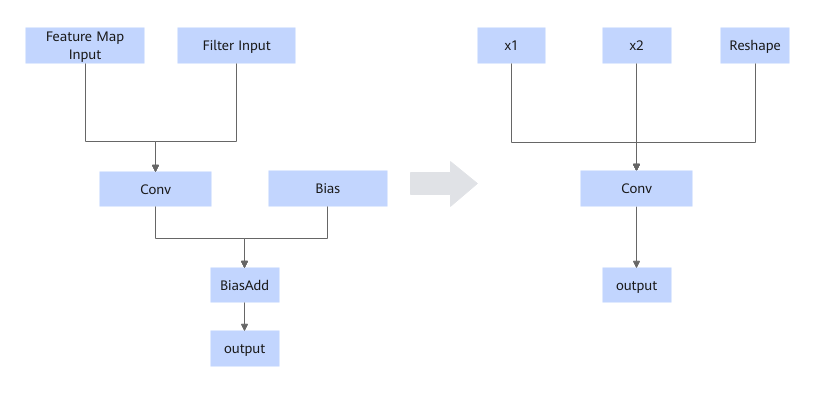

# AABiasaddConvFusion

## Integrated mode

Fuses the Conv operator without Bias and the BiasAdd operator into a Conv operator that contains the Bias input.

## Constraints

- If the Conv operator already has Bias, fusion is not supported.
- Dynamic scenarios are not supported.
- This fusion pattern cannot be disabled.

## Applicable Products

<!-- npu="310p" id1 -->
Atlas inference products
<!-- end id1 -->

<!-- npu="310b" id2 -->
Atlas 200I/500 A2 inference products
<!-- end id2 -->

<!-- npu="910" id3 -->
Atlas training products
<!-- end id3 -->

<!-- npu="910b" id4 -->
Atlas A2 training products/Atlas A2 inference products
<!-- end id4 -->

<!-- npu="950" id5 -->
950PR/950DT
<!-- end id5 -->
