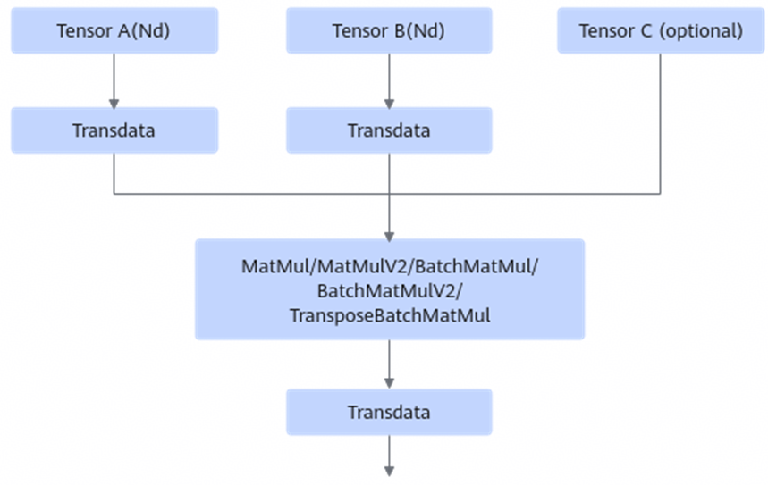
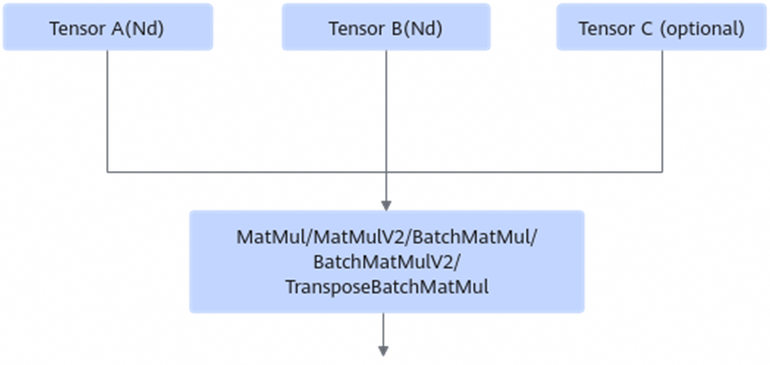
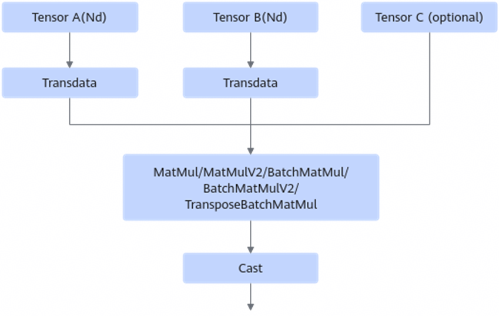
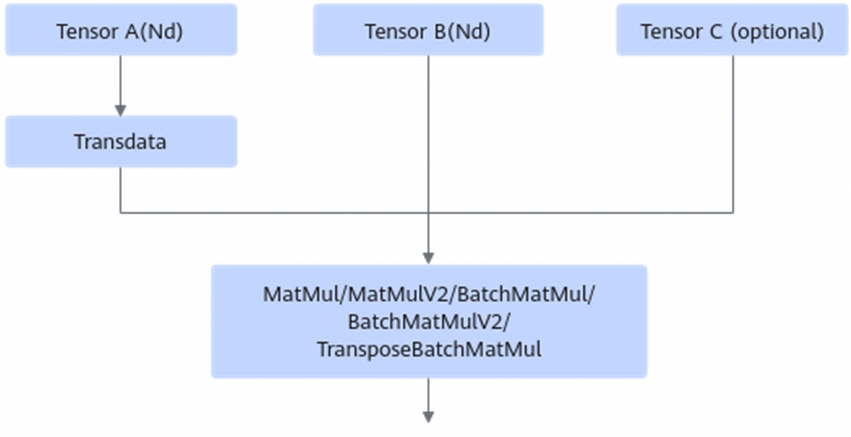
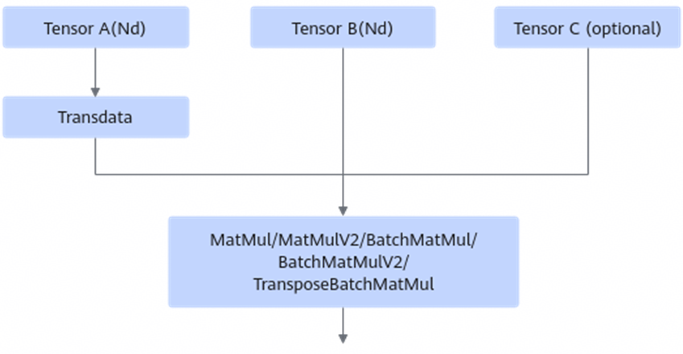
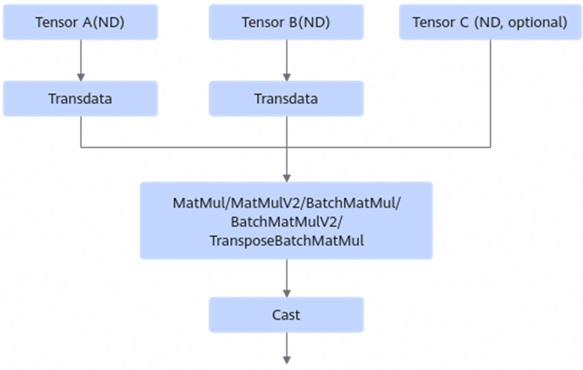
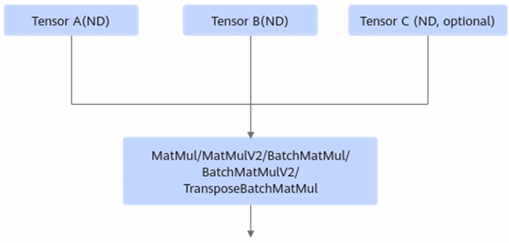

# AAMatMulNzToNdFusionPass

## Description

Reduces the TransData or Cast operator in the following four scenarios. Tensor C is optional.

- **Scenario 1**

After:

- **Scenario 2:**

After:

- **Scenario 3**

After:

- **Scenario 4**

After:

## Constraints

- Tensor A and Tensor B cannot both have static shapes, which are not multiples of 16.
- In scenario 1, the input and output formats of the TransData operator must be Fractal_Nz and Nd, respectively. In other scenarios, the output format of the MatMul operator must be Fractal_Nz.
- In scenarios 1, 2, and 4, the number of inputs and outputs of the TransData operator after Tensor B must be both 1, and the input and output formats must be Nd and Fractal_Nz, respectively.
- An output operator can have only one output, and so is the MatMul operator.
- The number of inputs and outputs of the TransData operator after Tensor A must be both 1, and the input and output formats must be Nd and Fractal_Nz, respectively.
- The operator type of Tensor A and Tensor B must be Data, and the number of outputs must be 1.
- The operator type of the output data node must be NetOutput.
- The input data type of the two MatMul operators corresponding to Tensor A and Tensor B must be float16.
- In scenario 2, the output data type of the MatMul operator must be float32. In scenarios 1, 3, and 4, the output data type of the MatMul operator must be float16.
- In scenarios 3 and 4, the output data type of the Cast operator must be float32.
