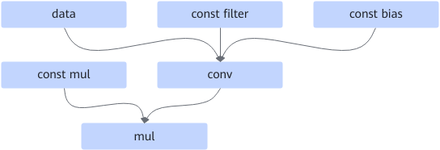
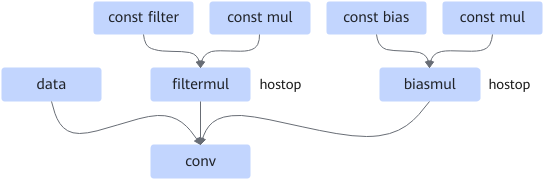

# AConv2dMulFusion

## Description

Fuses the Conv2d+mul or Conv3d+mul operators into one Conv operator.

Before:  After:

## Constraints

- The conv node can be Conv2D or Conv3D.
- When the data node has dynamic inputs, fusion is supported.
- When the three inputs of filter, bias, and mul are all of const type, fusion is supported.
- For Conv3D nodes, fusion is supported only when the data input is in NDHWC format, the Mul operator's const mul input is 1D, and its size matches the C dimension of the Conv3D output.
- For Conv3D nodes, fusion is supported only when the data input is in NDHWC format, the Mul operator's const mul input is also in NDHWC format, the NDHW dimensions are all 1, and the C dimension matches the C dimension of the Conv3D output.

## Applicable Products

<!-- npu="310p" id1 -->
Atlas inference products
<!-- end id1 -->

<!-- npu="310b" id2 -->
Atlas 200I/500 A2 inference products
<!-- end id2 -->

<!-- npu="910" id3 -->
Atlas training products
<!-- end id3 -->

<!-- npu="910b" id4 -->
Atlas A2 training products/Atlas A2 inference products
<!-- end id4 -->

<!-- npu="A3" id5 -->
Atlas A3 training products and Atlas A3 inference products
<!-- end id5 -->

<!-- npu="950" id7 -->
950PR/950DT
<!-- end id7 -->
