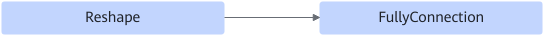
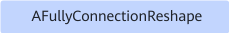

# AFullyConnectionReshapePass

## Description

Fuses the FullyConnection+Reshape operators into the AFullyConnectionReshape operator.

After:

## Constraints

- The number of output nodes of Reshape cannot exceed 1.
- The FullyConnection node must have the `axis` attribute, and the attribute value must be 1.
- The input and output dimensions of axis 0 of Reshape must be the same, and the output dimension cannot be 0.
