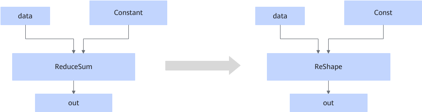

# AReduceSumFusionPass

## Description

Changes the ReduceSum operator that fits the graph fusion pattern to the Reshape operator in static scenarios.

## Constraints

- The fusion pattern does not take effect in dynamic scenarios.
- The axis is not an empty tensor, the axis size does not exceed the range of the input dimension, and the axis specified by the input parameter axis in the input shape is 1.
- This fusion pattern cannot be disabled.

## Applicable Products

<!-- npu="910b" id1 -->
Atlas A2 training products/Atlas A2 inference products
<!-- end id1 -->
