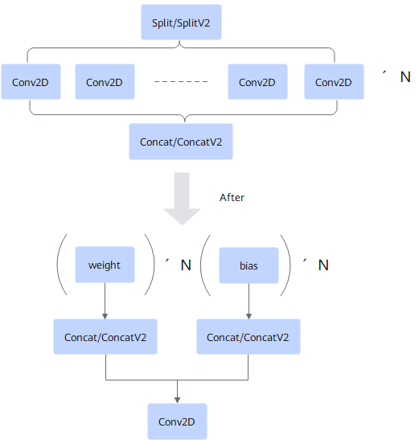

# ASplitConv2dConcatPass

## Description

Fuses the Split/SplitV, Conv2D*N, and Concat/ConcatV2 operators into a group convolution to simplify the graph structure.

## Constraints

- The number of inputs of each Conv2D must be the same and greater than or equal to 2.
- The shape and format of each Conv2D filter must be the same (only HWCN or NCHW is supported).
- Each Conv2D supports only one output.
- The filter and bias of Conv2D must be of any of the following types: `{"Const", "Constant", "QuantBiasOptimization", "QuantWeightRollBack", "QuantBiasRollBack", "AscendWeightQuant"}`.
- The Split/SplitV node and the other input of the Concat/ConcatV2 node must be of const type, and the number of outputs of the Split/SplitV node must be the same as the number of inputs of the Concat/ConcatV2 node.
- The split axis of the Split/SplitV node and the combination axis of the Concat/ConcatV2 node must both be the channel dimension.
  <!-- npu="910,310p,310b" id1 -->
- Conv2D supports only float, float16, int8, and int32 inputs, and does not allow dynamic inputs. This constraint applies to the following models:
  <!-- npu="310p" id2 -->
  - Atlas inference products
  <!-- end id2 -->
  <!-- npu="310b" id3 -->
  - Atlas 200I/500 A2 inference products
  <!-- end id3 -->
  <!-- npu="910" id4 -->
  - Atlas training products
  <!-- end id4 -->
  <!-- end id1 -->

  <!-- npu="950" id5 -->
- Conv2D supports only float, float16, and int8 inputs. This constraint applies to the following models:
  - 950PR/950DT
  <!-- end id5 -->

## Applicable Products

<!-- npu="310p" id6 -->
Atlas inference products
<!-- end id6 -->

<!-- npu="310b" id7 -->
Atlas 200I/500 A2 inference products
<!-- end id7 -->

<!-- npu="910" id8 -->
Atlas training products
<!-- end id8 -->

<!-- npu="950" id9 -->
950PR/950DT
<!-- end id9 -->
