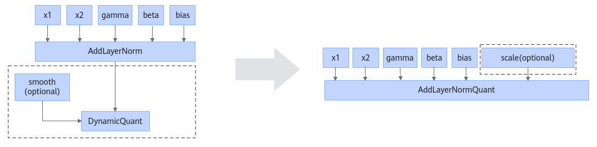
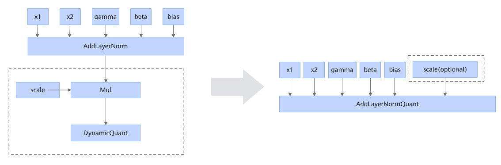

# AddLayerNormDynamicQuantFusionPass

## Description

Fuses AddLayerNorm and one or two downstream DynamicQuant operators into the AddLayerNormQuant operator.

There may be one or two structures in the dashed-line box.

When the optional smooth input of DynamicQuant exists, it will be placed in the position corresponding to the scale input of AddLayerNormQuant.

The smooth operation of DynamicQuant can also be expressed by Mul. In this scenario, the optional smooth input of DynamicQuant must be empty.

## Constraints

- For dtype:
  <!-- npu="950" id3 -->
  - For 950PR/950DT, the data type of AddLayerNorm x1 can be fp16, bf16, or fp32.
  <!-- end id3 -->
  <!-- npu="910b" id4 -->
  - For Atlas A2 training products/Atlas A2 inference products, the data type of AddLayerNorm x1 can be fp16 or bf16.
  <!-- end id4 -->
  - The data types of inputs x2, gamma, beta, and bias of AddLayerNorm must be the same as that of x1.
  - The input x of DynamicQuant must be of the same data type as x1 of AddLayerNorm.
  <!-- npu="950" id5 -->
  - For 950PR/950DT, if `smooth` exists in DynamicQuant, the dtype of `smooth` must be the same as that of x1 in AddLayerNorm.

  <!-- end id5 -->
- For the graph structure:
  - AddLayerNorm can have only one or two fan-outs for its output 0, connecting to a Mul node or a DynamicQuant node.
  - When AddLayerNorm has two fan-outs for its output 0, the two downstream nodes must be both Mul nodes or both DynamicQuant nodes.
  - When a downstream node of output 0 is Mul, it must have exactly one downstream DynamicQuant node, which must not contain the optional `smooth` input.

## Applicable Products

<!-- npu="910b" id1 -->
Atlas A2 training products/Atlas A2 inference products
<!-- end id1 -->

<!-- npu="950" id2 -->
950PR/950DT
<!-- end id2 -->
