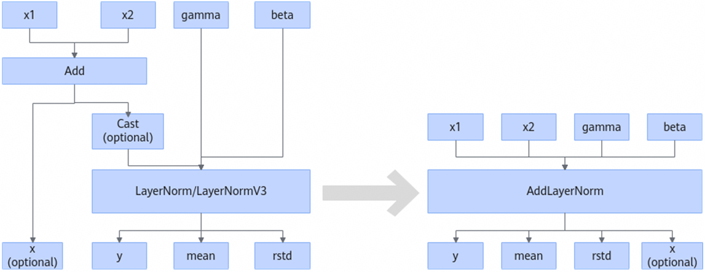
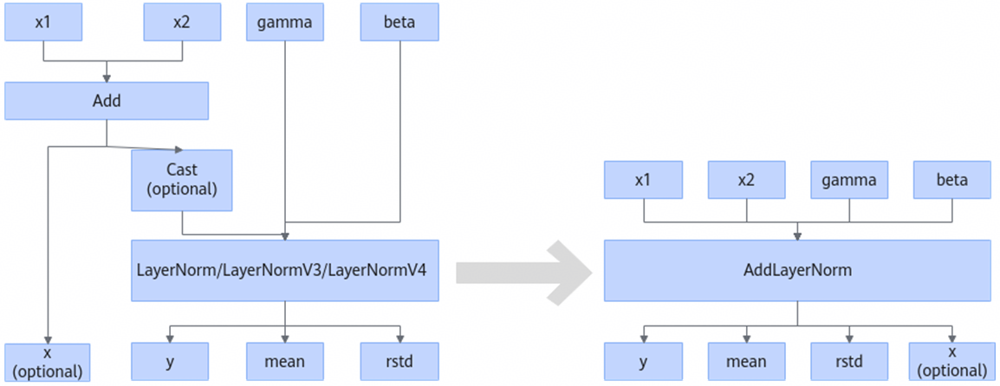
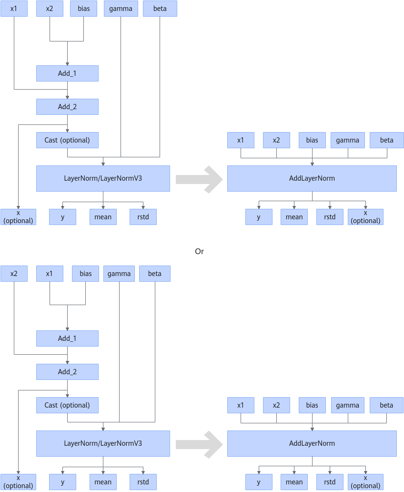
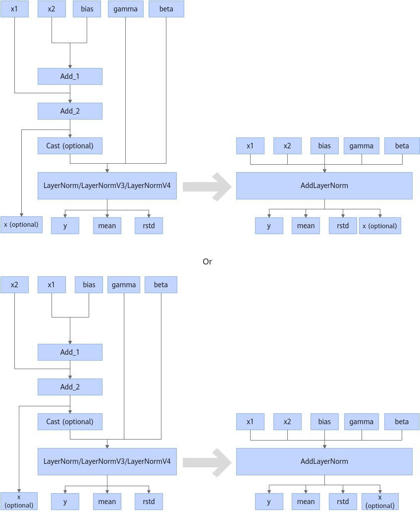
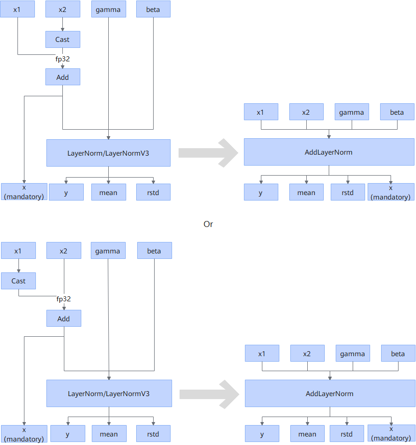
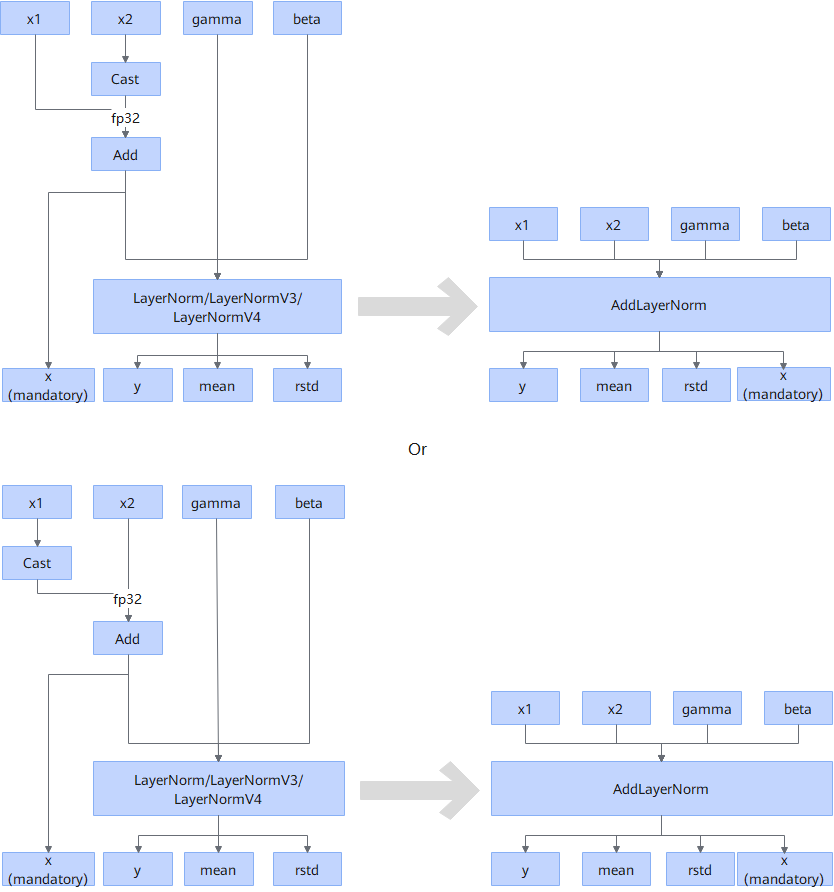
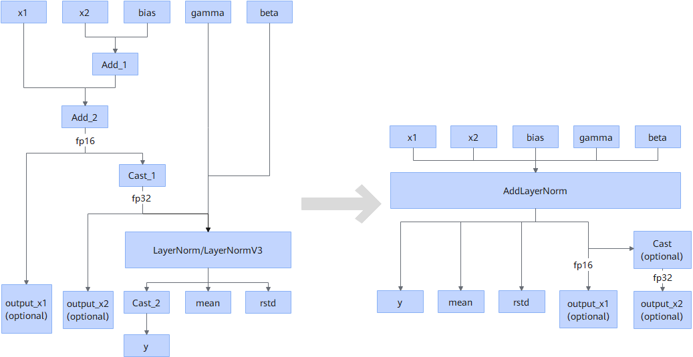
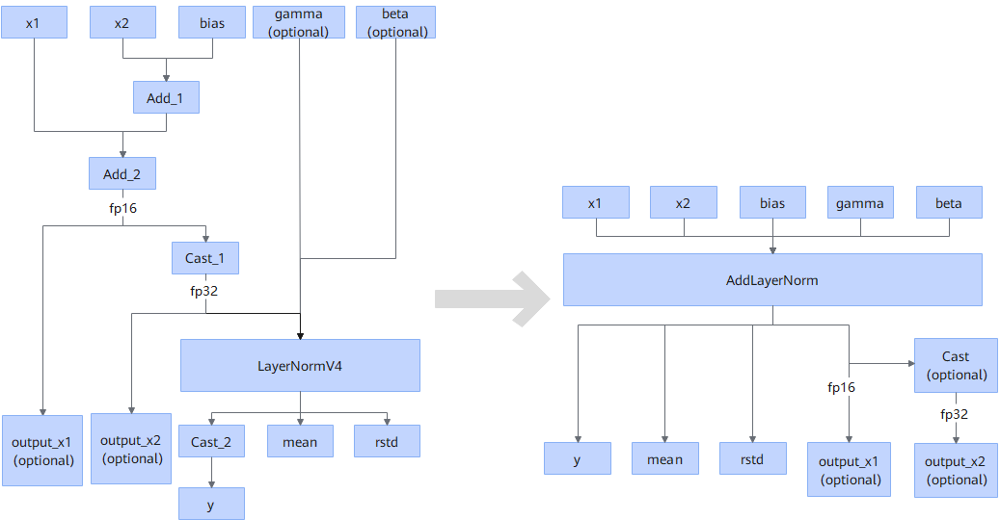

# AddLayerNormFusionPass

## Description

- Scenario 1: Fuses Add, Cast (optional), and LayerNorm/LayerNormV3/LayerNormV4 into the AddLayerNorm operator.
  

  

- Scenario 2: Fuses Add, Add, Cast (optional), and LayerNorm/LayerNormV3/LayerNormV4 into the AddLayerNorm operator.

  

  

- Scenario 3: Fuses Cast, Add, and LayerNorm/LayerNormV3/LayerNormV4 into the AddLayerNorm operator.

  

  

- Scenario 4: Fuses Add, Add, Cast, LayerNorm/LayerNormV3/LayerNormV4, and Cast into the AddLayerNorm operator.

  

  or

  

## Constraints

- Constraints on data types:
  - In scenario 1, only the following input data type combinations are supported:

   |x1|x2|gamma|beta|
   |:-:|:-:|:-:|:-:|
   |FLOAT16|FLOAT16|FLOAT16|FLOAT16|
   |BFLOAT16|BFLOAT16|BFLOAT16|BFLOAT16|
   |FLOAT16|FLOAT16|FLOAT32|FLOAT32|
   |BFLOAT16|BFLOAT16|FLOAT32|FLOAT32|
   |FLOAT16|FLOAT16|BFLOAT16|BFLOAT16|
   |BFLOAT16|BFLOAT16|FLOAT16|FLOAT16|

  - In scenario 2, only the following input data type combinations are supported:

   |x1|x2|gamma|beta|(Optional) bias|
   |:-:|:-:|:-:|:-:|:-:|
   |FLOAT16|FLOAT16|FLOAT16|FLOAT16|FLOAT16|
   |BFLOAT16|BFLOAT16|BFLOAT16|BFLOAT16|BFLOAT16|
   |FLOAT16|FLOAT16|FLOAT32|FLOAT32|FLOAT16|
   |BFLOAT16|BFLOAT16|FLOAT32|FLOAT32|BFLOAT16|
   |FLOAT16|FLOAT16|BFLOAT16|BFLOAT16|FLOAT16|
   |BFLOAT16|BFLOAT16|FLOAT16|FLOAT16|BFLOAT16|

  - In scenario 3, only the following input data type combinations are supported:

   |x1|x2|gamma|beta|
   |:-:|:-:|:-:|:-:|
   |FLOAT16|FLOAT32|FLOAT32|FLOAT32|
   |FLOAT16|FLOAT32|FLOAT16|FLOAT16|
   |FLOAT16|FLOAT32|BFLOAT16|BFLOAT16|
   |FLOAT32|FLOAT16|FLOAT32|FLOAT32|
   |FLOAT32|FLOAT16|FLOAT16|FLOAT16|
   |FLOAT32|FLOAT16|BFLOAT16|BFLOAT16|
   |BFLOAT16|FLOAT32|FLOAT32|FLOAT32|
   |BFLOAT16|FLOAT32|FLOAT16|FLOAT16|
   |BFLOAT16|FLOAT32|BFLOAT16|BFLOAT16|
   |FLOAT32|BFLOAT16|FLOAT32|FLOAT32|
   |FLOAT32|BFLOAT16|FLOAT16|FLOAT16|
   |FLOAT32|BFLOAT16|BFLOAT16|BFLOAT16|

  - For the data types supported in scenario 4:
    - x1, x2, and bias must share the same data type, limited to FLOAT16 or BFLOAT16.
    - gamma and beta must share the same data type, limited to FLOAT32.

  - For other data types:

    For training tasks, the data type of the input x1 or x2 cannot be FLOAT16.

- For shapes:
  - The shapes of x1 and x2 must be the same.
  - The shapes of gamma and beta must be 1D, and the shape value must be the same as the tail axis of the input shape of x1 and x2, that is, gamma.shape = beta.shape = [x1.shape[-1]].
  - In scenario 4, the last dimension of the shapes of x1, x2, and bias must be the same.

- For the Cast and Add operators:
  - If the fusion pattern is scenario 3, the output type of the Cast operator must be FLOAT32, and the Add operator must have the x output.
  - In scenario 4, if output_x2 is not output before fusion, the Cast operator is not executed after fusion.

- Impact on precision:

  For scenario 1 or 2 where Cast exists between LayerNorm and Add:

  If the Cast input type is FLOAT16/BFLOAT16 and the output type is FLOAT32, the data type of the output y is FLOAT16/BFLOAT16 when the AddLayerNorm fusion pattern is used. The precision is lower than that before fusion.

- During training in scenario 4, LayerNormV3 or LayerNormV4 is supported before fusion.

## Applicable Products

<!-- npu="910b" id1 -->
Atlas A2 training products/Atlas A2 inference products
<!-- end id1 -->

<!-- npu="950" id2 -->
950PR/950DT
<!-- end id2 -->
