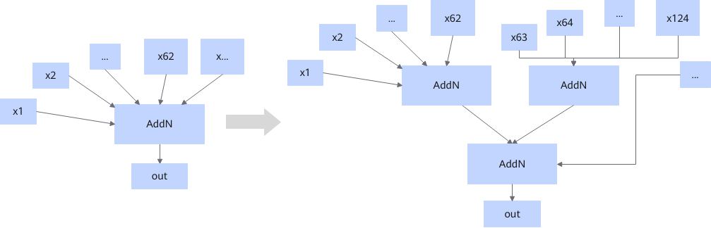

# AddNFusionPass

## Description

Groups a large number of inputs according to the following rules, and adds the sum of each group together.

N = 62k + r, where N is the number of inputs, and r is the remainder of dividing N by 62.

- Rule 1 (r = 0): Divide into k groups, each with 62 inputs.
- Rule 2 (r = 1): Divide into k groups, with k – 1 groups of 62 inputs and the last group of 63 inputs.
- Rule 3 (2 ≤ r < 62): Divide into k + 1 groups, with k groups of 62 inputs and the last group of r inputs.

## Constraints

- All inputs must meet the requirements of the AddN operator.
- This fusion pattern cannot be disabled.

## Applicable Products

<!-- npu="910b" id1 -->
Atlas A2 training products/Atlas A2 inference products
<!-- end id1 -->
