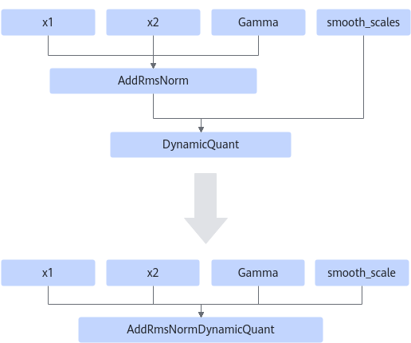
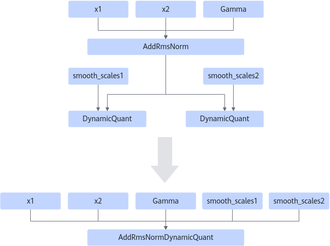

# AddRmsNormDynamicQuantFusionPass

## Description

Fuses the AddRmsNorm and DynamicQuant operators that comply with the graph fusion pattern into fused operator AddRmsNormDynamicQuant. The output y of the AddRmsNorm operator is used as the first input of the DynamicQuant operator.

Pattern 1: single-channel

Pattern 2: dual-channel

## Constraints

- Before fusion, the input types of the AddRmsNorm and DynamicQuant operators must be the same (fp16 or bf16).
  <!-- npu="A3,910b" id4 -->
- For the output yout of DynamicQuant:
  <!-- npu="910b" id5 -->
  - Atlas A2 training products/Atlas A2 inference products: yout supports only the int8 quantization type.
  <!-- end id5 -->
  <!-- npu="A3" id6 -->
  - Atlas A3 training products/Atlas A3 inference products: yout supports only the int8 quantization type.
  <!-- end id6 -->
  <!-- end id4 -->

- Data type: If there is a smoothing coefficient, the data type of DynamicQuant's `smooth_scales` must be the same as that of AddRmsNorm's x1 input.

- Shape: The shape of the gamma input must be 1D, and its size must match the last dimension of the inputs x1 and x2, that is, gamma.shape = [x1.shape[-1]].

- attr:
  <!-- npu="950" id7 -->
  - 950PR/950DT: `dst_type` supports only DT_INT8, DT_HIFLOAT8, DT_FLOAT8_E4M3FN, and DT_FLOAT8_E5M2.
  <!-- end id7 -->
  <!-- npu="910b" id8 -->
  - Atlas A2 training products/Atlas A2 inference products: `dst_type` supports only DT_INT8.
  <!-- end id8 -->
  <!-- npu="A3" id9 -->
  - Atlas A3 training products/Atlas A3 inference products: `dst_type` supports only DT_INT8.
  <!-- end id9 -->
  - In dual-channel pattern, `dst_type` of DynamicQuant0 and DynamicQuant1 must be the same.

## Applicable Products

<!-- npu="910b" id1 -->
Atlas A2 training products/Atlas A2 inference products
<!-- end id1 -->

<!-- npu="A3" id2 -->
Atlas A3 training products and Atlas A3 inference products
<!-- end id2 -->

<!-- npu="950" id3 -->
950PR/950DT
<!-- end id3 -->
