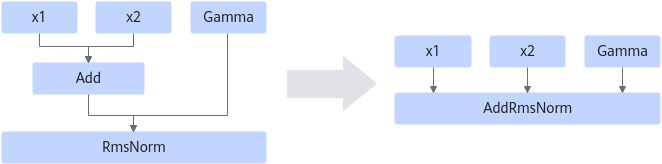

# AddRmsNormFusionGraphPass

## Description

Fuses the Add and RmsNorm operators that comply with the graph fusion pattern into the fused operator AddRmsNorm. The output of the Add operator is used as the first input of the RmsNorm operator.

## Constraints

- The shape and dtype of the inputs X1 and X2 of the Add operator must be the same.
- The format can only be ND.

## Applicable Products

<!-- npu="910b" id1 -->
Atlas A2 training products/Atlas A2 inference products
<!-- end id1 -->

<!-- npu="A3" id2 -->
Atlas A3 training products and Atlas A3 inference products
<!-- end id2 -->

<!-- npu="950" id3 -->
950PR/950DT
<!-- end id3 -->
