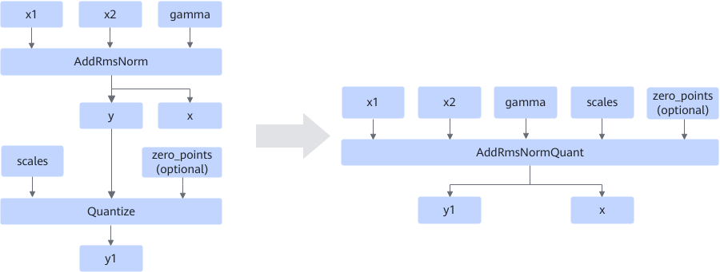
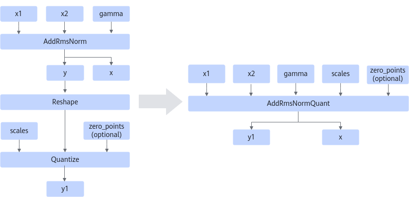

# AddRmsNormQuantFusionPass

## Description

Fuses the structure that meets the following patterns into the AddRmsNormQuant operator.

Scenario 1: Fuses the AddRmsNorm and Quantize operators that comply with the graph fusion pattern into fused operator AddRmsNormQuant. The output y of the AddRmsNorm operator is used as the first input of the Quantize operator.

Scenario 2: Fuses the AddRmsNorm, Reshape, and Quantize operators that comply with the graph fusion pattern into fused operator AddRmsNormQuant. The output y of the AddRmsNorm operator is used as the input of the Reshape operator, and the output of the Reshape operator is used as the first input of the Quantize operator.

## Constraints

  <!-- npu="A3,910b,310p" id5 -->
- In the following products, the Quantize operator is restricted to producing int8 outputs only.
  <!-- npu="910b" id6 -->
  - Atlas A2 training products/Atlas A2 inference products
  <!-- end id6 -->
  <!-- npu="310p" id7 -->
  - Atlas inference products
  <!-- end id7 -->
  <!-- npu="A3" id8 -->
  - Atlas A3 training products and Atlas A3 inference products
  <!-- end id8 -->
  <!-- end id5 -->

- The x1 input of AddRmsNorm supports only the float16 and bfloat16 data types, and the last axis of x1's shape must be 32-byte aligned.
- The AddRmsNorm operator before fusion does not output rstd.
- The AddRmsNormQuant operator after fusion does not output y2.
- The number of elements in the inputs `scales` and `zero_points` before and after fusion must be the same as that of the input gamma. If the shape dimension of the input gamma before fusion is inconsistent with that of `scales` or `zero_point`, you are advised to follow scenario 2 for fusion.

## Applicable Products

<!-- npu="910b" id1 -->
Atlas A2 training products/Atlas A2 inference products
<!-- end id1 -->

<!-- npu="310p" id2 -->
Atlas inference products
<!-- end id2 -->

<!-- npu="A3" id3 -->
Atlas A3 training products and Atlas A3 inference products
<!-- end id3 -->

<!-- npu="950" id4 -->
950PR/950DT
<!-- end id4 -->
