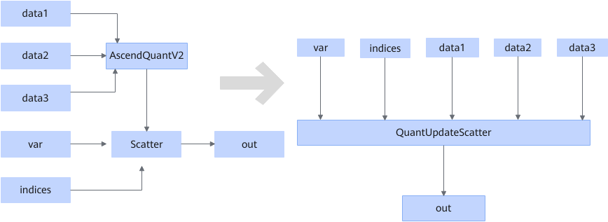

# AscendQuantV2ScatterFusionPass

## Description

Fuses the structure that meets the following pattern into the QuantUpdateScatter operator.

## Constraints

- AscendQuantV2 has only one output, which is provided to the Scatter node. The output is of the int8, hifloat8, float8_e5m2, or float8_e4m3fn data type.
- For AscendQuantV2, `sqrt_mode` is set to `false`, `round_mode` is set to `round`, and `reduce` of the Scatter node is set to `update`.
- When the third input of AscendQuantV2 exists, the data type must be bfloat16.
- For AscendQuantV2, input0 must be of the float16 or bfloat16 type, and input1 must be of the bfloat16 or float32 type.
- The number of input0 dimensions of AscendQuantV2 must be the same as the number of var dimensions of Scatter. The size of `axis` must be less than or equal to that of `axis` of var. The sizes of other axes must be the same, the size of the first axis of input0 of AscendQuantV2 is equal to the size of the first axis of indices of Scatter.
- The total number of elements in input1 of AscendQuantV2 is equal to the size of the last dimension of input0. If input2 exists, the total number of elements is equal to the size of the last dimension of input0.
- The indices dimensions of Scatter can only be 1 or 2. If the dimension is 2, the size of the second dimension must be 2.
- The `axis` attribute of Scatter is -2.

## Applicable Products

<!-- npu="910b" id1 -->
Atlas A2 training products/Atlas A2 inference products
<!-- end id1 -->

<!-- npu="950" id2 -->
950PR/950DT
<!-- end id2 -->
