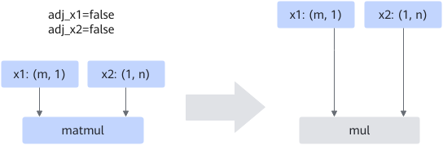
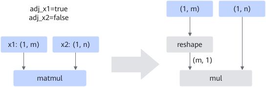

# BatchMatMul2MulFusionPass

## Description

MatMul/MatMulv2/MatMulV3/BatchMatmul/BatchMatMulV2/BatchMatMulV3 operators with k=1 exist in the network, and the performance is poor. This graph fusion converts MatMul/MatMulv2/MatMulV3/BatchMatmul/BatchMatMulV2/BatchMatMulV3 into mul to solve the performance problem.

<!-- npu="950" id4 -->
>[!NOTE]
>For 950PR/950DT, only the MatMul/MatMulv2/MatMulV3 nodes are fused, not the BatchMatmul/BatchMatMulV2/BatchMatMulV3 nodes.
<!-- end id4 -->

If the input **adj** is set to **true**, insert the reshape operator before the input.

## Constraints

- It applies only to static scenarios. The input does not contain bias.
- The dtype meets the following conditions:
  - Float32 for both input and output
  - Float16 or BFloat16 for both input and output

## Applicable Products

<!-- npu="910b" id1 -->
Atlas A2 training products/Atlas A2 inference products
<!-- end id1 -->

<!-- npu="A3" id2 -->
Atlas A3 training products/Atlas A3 inference products
<!-- end id2 -->

<!-- npu="950" id3 -->
950PR/950DT
<!-- end id3 -->
