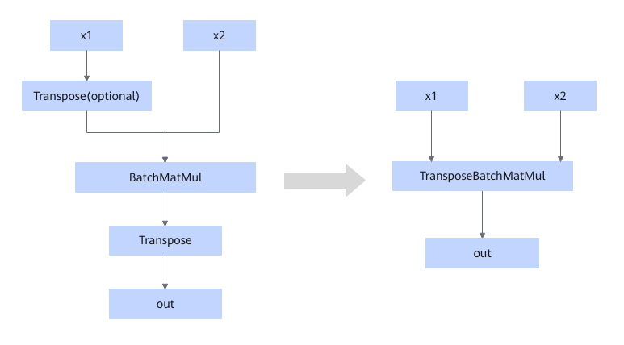
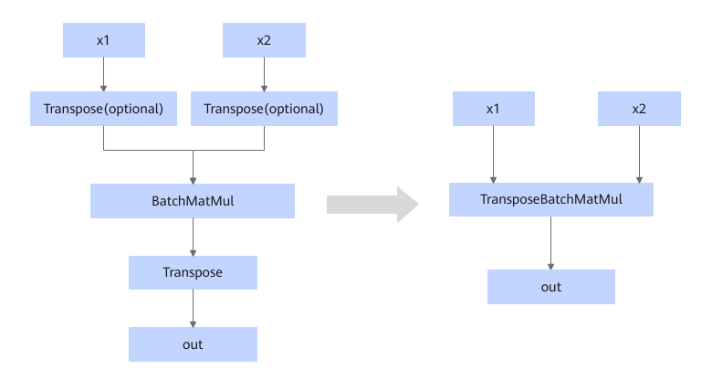
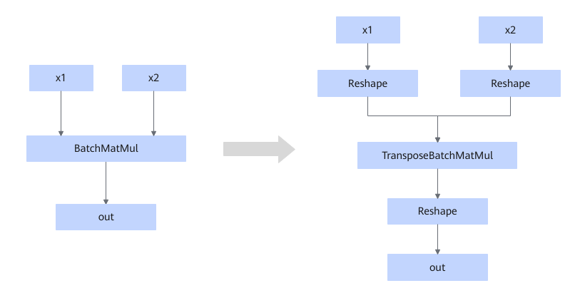
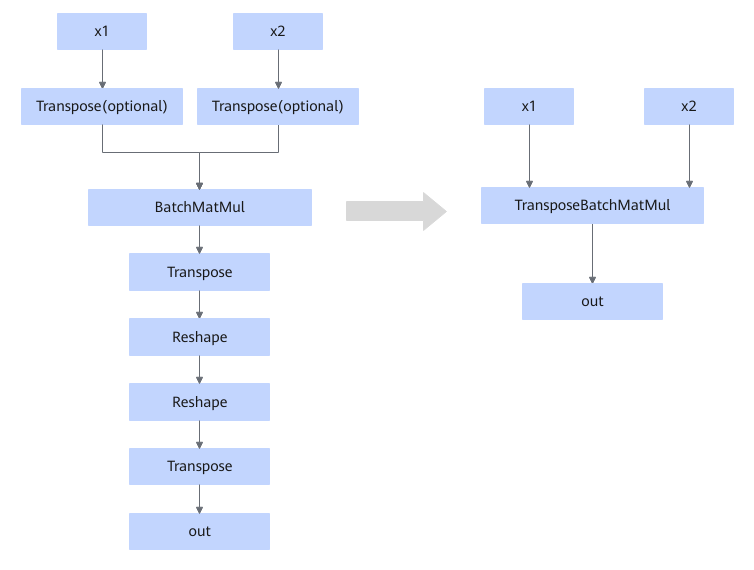

# BatchMatMul2TransposeBatchMatMulFusionPass

## Description

**Pattern 1**

When the Transpose (optional), BatchMatMul, and Transpose operators are connected in the sequence shown in the following figure, they can be fused into the TransposeBatchMatmul operator.

<!-- npu="A3,910b" id4 -->
The following models are supported:

<!-- npu="910b" id9 -->
- Atlas A2 training products/Atlas A2 inference products
<!-- end id9 -->
<!-- npu="A3" id10 -->
- Atlas A3 training products/Atlas A3 inference products
<!-- end id10 -->

<!-- end id4 -->

<!-- npu="950" id5 -->
The fusion patterns for 950PR/950DT are as follows:

<!-- end id5 -->
**Pattern 2**

When the shape of the x1 input of the BatchMatMul/BatchMatMulV2 node is [B2,B1,1,K] and the shape of the x2 input is [1,B1,K,N] or [1,B1,N,K], a Reshape node is inserted to merge axes, resulting in x1 [B2,B1,K] and x2 [B1,K,N] or [B1,N,K]. Then a TransposeBatchMatMul node is called to produce the result [B2,B1,N]. Another Reshape node is inserted to transform the result into [B2,B1,1,N].

**Pattern 3**

When the Transpose (optional), Transpose (optional), BatchMatMul, Transpose, Reshape, Reshape, and Transpose operators are connected in the sequence shown in the following figure, they can be fused into the TransposeBatchMatmul operator.

## Constraints

**Pattern 1**

- The supported data types of the inputs x1 and x2 and the output `out` (the inputs must correspond to the output) are BFLOAT16, FLOAT16, and FLOAT32.
- The input and output data formats must be ND.
  <!-- npu="A3,910b" id6 -->
- Input x1 supports [B, M, K] or [M, B, K], and input x2 supports only [B, K, N]. The corresponding attributes of TransposeBatchMatMul are `perm_x1=[0,1,2]/[1,0,2]` and `perm_x2=[0,1,2]`. This constraint applies only to the following models: 
  <!-- npu="910b" id7 -->
  - Atlas A2 training products/Atlas A2 inference products
  <!-- end id7 -->
  <!-- npu="A3" id8 -->
  - Atlas A3 training products/Atlas A3 inference products
  <!-- end id8 -->
  <!-- end id6 -->

  <!-- npu="950" id11 -->
- Input x1 is [B, M, K] or [M, B, K], and input x2 is [B, K, N] or [B, N, K]. The corresponding attributes of TransposeBatchMatMul are `perm_x1=[0,1,2]/[1,0,2]` and `perm_x2=[0,1,2]/[0,2,1]`. This constraint applies only to the following models:
  950PR/950DT

  <!-- end id11 -->
  
**Pattern 2**

- Input x1 is [B2,B1,1,K] and input x2 is [1,B1,K,N] or [1,B1,N,K]. The corresponding BatchMatmul attributes are `adj_x1=false` and `adj_x2=false/true`.
- The supported data types of the inputs x1 and x2 and the output `out` (the inputs must correspond to the output) are FLOAT32.
- The input and output data formats must be ND.
  <!-- npu="A3,910b" id12 -->
- This fusion pattern does not support HFLOAT32. This constraint applies only to the following models:
  - Atlas A2 training products/Atlas A2 inference products
  - Atlas A3 training products/Atlas A3 inference products

- The input must meet the following condition: B1 × K < 65536. This constraint applies only to the following models:
  - Atlas A2 training products/Atlas A2 inference products
  - Atlas A3 training products/Atlas A3 inference products

- When the input data type is BFLOAT16 or FLOAT16, K and N are 128-aligned. The following conditions must be met: B × K < 65536 or B × K ≥ 65536 (K < 65536). This constraint applies only to the following models:
  - Atlas A2 training products/Atlas A2 inference products
  - Atlas A3 training products/Atlas A3 inference products

- When the input data type is FLOAT32 and the input Transpose nodes are not empty, there is no alignment constraint, but the following condition must be met: B × K < 65536. This constraint applies only to the following models:
  - Atlas A2 training products/Atlas A2 inference products
  - Atlas A3 training products/Atlas A3 inference products

  <!-- end id12 -->
  
**Pattern 3**

- Output `out` is [B1,M,B/B1*N], where B must be divisible by B1.
- The supported data types of the inputs x1 and x2 and the output `out` (the inputs must correspond to the output) are BFLOAT16, FLOAT16, and FLOAT32.
- The input and output data formats must be ND.
  <!-- npu="A3,910b" id13 -->
- Input x1 supports [B,M,K] or [M,B,K], and input x2 supports only [B, K, N]. The corresponding attributes of TransposeBatchMatMul are `perm_x1=[0,1,2]/[1,0,2]` and `perm_x2=[0,1,2]`. This constraint applies only to the following models:
  - Atlas A2 training products/Atlas A2 inference products
  - Atlas A3 training products/Atlas A3 inference products
  <!-- end id13 -->

    <!-- npu="950" id14 -->
- Input x1 is [B,M,K] or [M,B,K], and input x2 is [B,K,N] or [B,N,K]. The corresponding attributes of TransposeBatchMatMul are `perm_x1=[0,1,2]/[1,0,2]` and `perm_x2=[0,1,2]/[0,2,1]`. This constraint applies only to the following models:

    950PR/950DT
    <!-- end id14 -->

- When the input data type is BFLOAT16 or FLOAT16, K and N are 128-aligned. The following conditions must be met: B × K < 65536 or B × K ≥ 65536 (K < 65536). This constraint applies only to the following models:
  - Atlas A2 training products/Atlas A2 inference products
  - Atlas A3 training products/Atlas A3 inference products

  <!-- npu="A3,910b" id15 -->
- When the input data type is FLOAT32 and the input Transpose nodes are not empty, there is no alignment constraint, but the following condition must be met: B × K < 65536. This constraint applies only to the following models:
  - Atlas A2 training products/Atlas A2 inference products
  - Atlas A3 training products/Atlas A3 inference products
  <!-- end id15 -->

## Applicable Products

<!-- npu="910b" id1 -->
Atlas A2 training products/Atlas A2 inference products
<!-- end id1 -->

<!-- npu="A3" id2 -->
Atlas A3 training products/Atlas A3 inference products
<!-- end id2 -->

<!-- npu="950" id3 -->
950PR/950DT
<!-- end id3 -->
