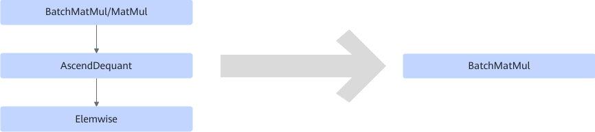

# BatchMatMulDequantElemwiseFusionPass

## Description

Fuses BatchMatMul/MatMul, AscendDequant, and Elemwise into the BatchMatMul operator in quantization use cases. The Elemwise operator is broadcast to MatMul.

## Constraints

- The two inputs of Elemwise must have the same dimensions and both have the **batch** axis. Elemwise can be broadcast to the MatMul shape only on the **batch** axis.
- Elemwise supports only the Add and Sub operators.
- The input format of Elemwise must be FRACTAL_NZ.

## Applicable Products

<!-- npu="310b" id1 -->
Atlas 200I/500 A2 inference products
<!-- end id1 -->
