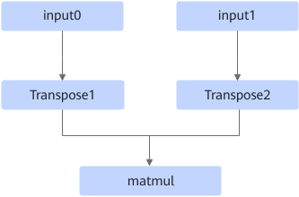
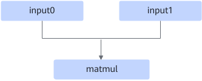

# BatchMatMulFusionPass

## Description

There are two fusion patterns:

**Pattern 1**: The transpose nodes that meet the following pattern relationship are eliminated.

After:

**Pattern 2**: When the input shape of BatchMatMul is 2D, BatchMatMul is converted to MatMul. This fusion pattern is disabled by default.

## Constraints

For pattern 1:

- Transpose1 and Transpose2 can coexist, or only one of them exists.
- Transpose types include Transpose and TransposeD.
- The Transpose node swaps only the last two dimensions of the input. For example, the input shape of the Transpose node is (batch, a, b), and the output shape is (batch, b, a).
- The Matmul types include BatchMatMul/BatchMatMulV2/MatMul/MatMulV2.
- The input dtype of the Matmul node can only be float16, float32, or bfloat16.
