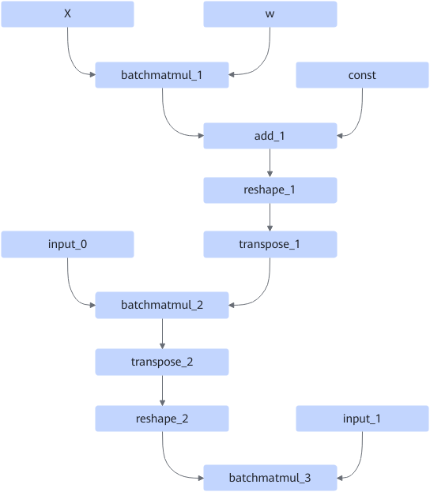
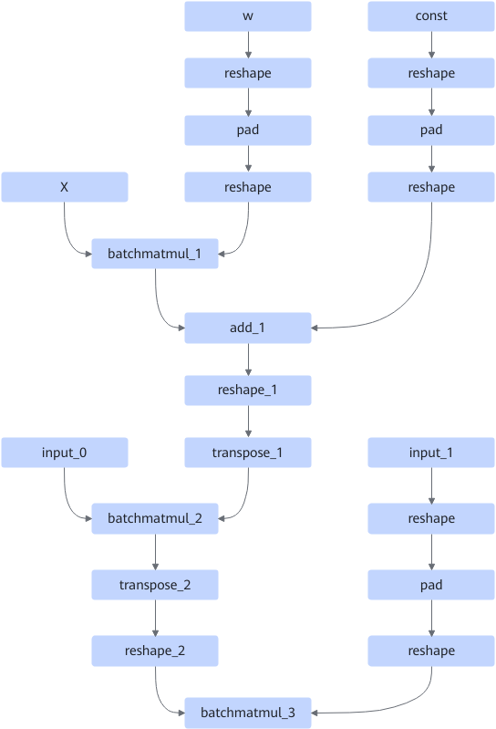
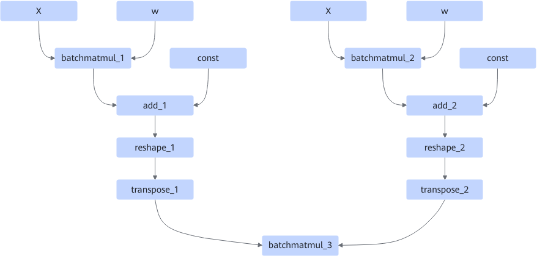
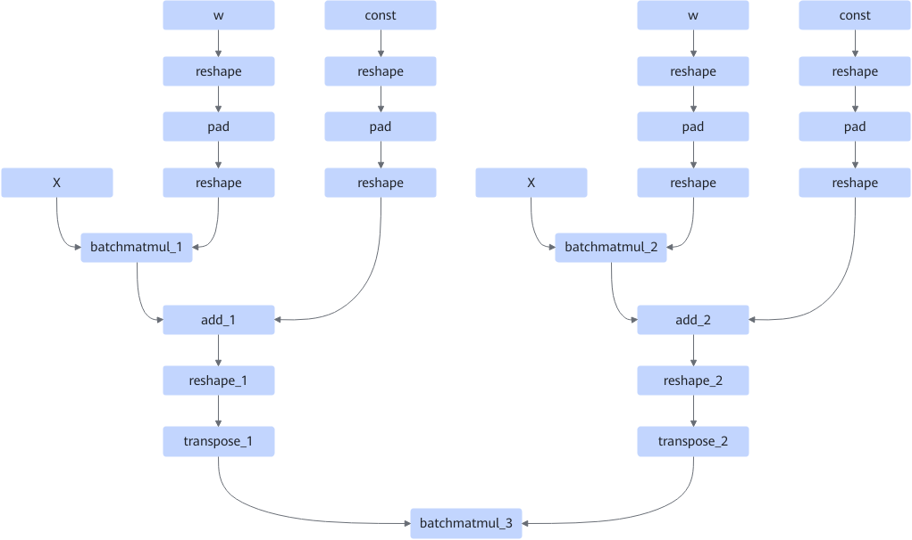

# BatchMatMulNonAlignedFusionPass

## Description

Performs fusion in BatchMatMul non-alignment use cases.

Pattern 1:

After:

Pattern 2:

After:

## Constraints

The input dimension M of BatchMatMul must be a multiple of 16, while the input dimension K must not be a multiple of 16.

Constraints on the perm value in transpose are as follows:

1. If add_2 does not exist, the value of `transpose.perm` is `{0,2,1,3}`.

2. If add_2 exists, the value of `transpose_1.perm` is `{0,2,1,3}`, and the value of `transpose_2.perm` is `{0,2,3,1}`.
