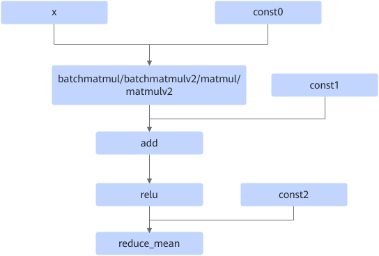
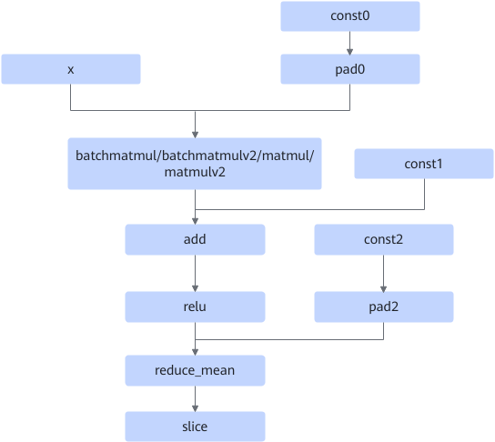

# BatchMatMulReduceMeanFusionPass

## Description

Adds the pad operator node to the constant input of the batchmatmul/batchmatmulv2/matmul/matmulv2/reducemean operator node to improve computing performance.

After:

## Constraints

- The input1 of the batchmatmul/batchmatmulv2/matmul/matmulv2 node must be a const node.
- In the output matrix (m,n) or (b,m,n) of the batchmatmul/batchmatmulv2/matmul/matmulv2 node, the m dimension must be a multiple of 16, and the n dimension must not be a multiple of 16.
- The ReduceMean node must have the `axes` attribute, and the last axis of the node cannot be reduced.
- The const input shape of the add operator must be 1D and consistent with the n-dimensional output of Matmul.
