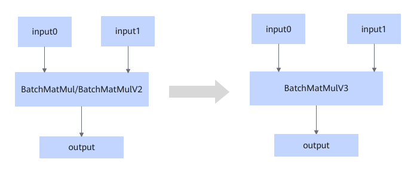

# BatchMatMulToBatchMatmulV3FusionPass

## Description

Converts the BatchMatMulV2/BatchMatMul operator that meets the fusion pattern into the BatchMatMulV3 operator.

## Applicable Products

<!-- npu="950" id1 -->
950PR/950DT
<!-- end id1 -->
