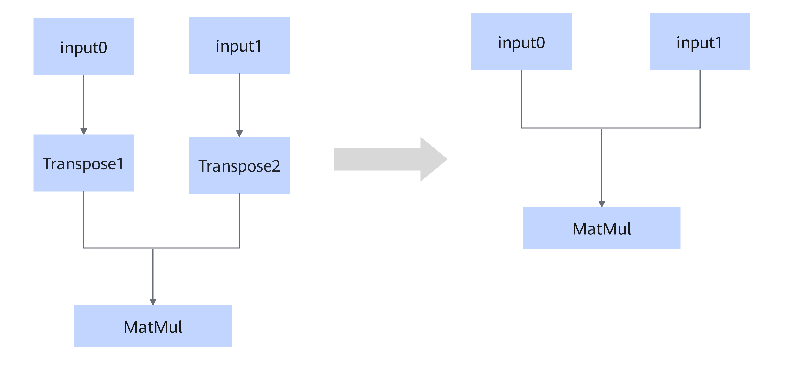

# BatchMatMulTransposeFusionPass

## Description

Fuses the Transpose1/Transpose2 operators that meet the graph fusion pattern.

## Constraints

- Transpose1 and Transpose2 can coexist, or only one of them exists.
- The Transpose type has no variants.
- The Transpose node swaps only the last two dimensions of the input. For example, if the input shape of the Transpose node is (batch, a, b), the output shape is (batch, b, a).
- The MatMul types include BatchMatMul, BatchMatMulV2, MatMul, and MatMulV2.
- The input dtype of the MatMul node can only be float16, float32, or bfloat16.

## Applicable Products

<!-- npu="950" id1 -->
950PR/950DT
<!-- end id1 -->
