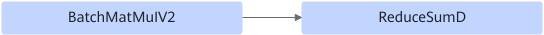

# BatchMatMulV2ReduceFusionPass

## Description

Fuses the BatchMatMulV2+ReduceSumD operators into the BatchMatMulV2 operator.

Pattern 1:

 After: 

Pattern 2:

 After: 

## Constraints

- The left and right matrices of BatchMatMulV2 are 3D and the batch axis is greater than 1.
- BatchMatMulV2 supports only float32, float16, and bfloat16 data types.
- Nodes in graph fusion are static.
- The construction graph must be either BatchMatMulV2-->Cast32-->ReduceSumD-->Output or BatchMatMulV2-->ReduceSumD-->Output.
- If the node after BatchMatMulV2 is Cast32, the output data type is float16, and the output data type of Cast is float32.
- BatchMatMulV2 must have two input nodes and one output node.
