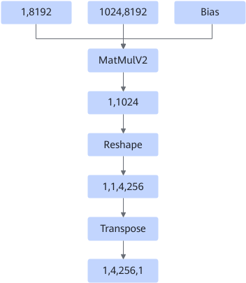
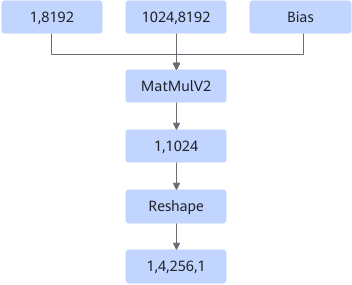
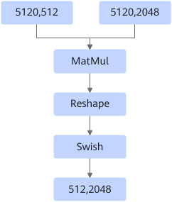
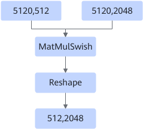
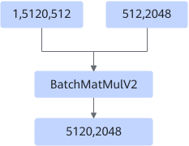
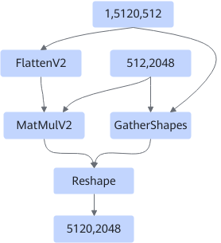
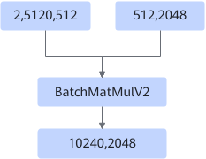
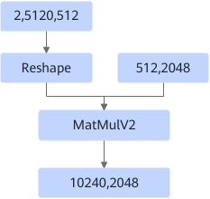

# BatchMatMulV2ReshapeFusionPass

## Description

The fusion is classified into the following scenarios:

Scenario 1: In the special case of MatMulV2+Reshape, the output is 4D and is transposed. The fused Transpose node improves performance. The shape of the Reshape node must be `(m,n) -> (m,1,tp,n/tp)`, where `tp` indicates the number of tensor parallel split groups. The `perm` parameter of the Transpose node can only be set to `[0,2,1,3]` or `[0,2,3,1]`.

After:

Scenario 2: For MatMul+Reshape+Swish fusion, the rear Reshape ensures the fusion of MatMul+Swish.

After:

Scenario 3: Non-Atlas inference products or trustlist cases of Atlas inference products support fusion of 3D x 2D BatchMatMulV2 operations into 2D x 2D MatMulV2 operations (dynamic or static scenario).

- Dynamic scenario:

    

    After:

    

- Static scenario:

    

    After:

    

## Constraints

- The fusion node is BatchMatmulV2, MatMulV2, or MatMul.
- The input data type cannot be INT4 or INT8.
- When the input optype is BatchMatMulV2, the left matrix must be 3D and the right matrix must be 2D.
- When the input optype is MatMulV2, the dtype of the left input of the input node must be fp16.
- In dynamic scenarios, the left and right matrices cannot be transposed.
- In static scenarios, the left matrix must not be transposed, and the left and right matrices cannot be in NZ format. When the matrix is 3 x 2 dimensions, batch × m cannot be greater than max(int64).
- In static scenarios, if BatchMatMulV2 is followed by Add, Relu, AddN, or Mul operators, the graph fusion patterns take effect when the batch dimension is greater than 50 and the M dimension is less than 32 or when M is 1 and the batch dimension is greater than 1.
- In static scenarios, for a single BatchMatMulV2 with a large batch size, the graph fusion patterns take effect when the batch dimension is greater than 4096 and the M dimension is less than 64 or when M is 1 and the batch dimension is greater than 1.
<!-- npu="310p" id6 -->
- For Atlas inference products, this graph fusion pattern takes effect only in trustlisted cases.
<!-- end id6 -->

## Applicable Products

<!-- npu="310p" id1 -->
Atlas inference products
<!-- end id1 -->

<!-- npu="310b" id2 -->
Atlas 200I/500 A2 inference products
<!-- end id2 -->

<!-- npu="910" id3 -->
Atlas training products
<!-- end id3 -->

<!-- npu="910b" id4 -->
Atlas A2 training products/Atlas A2 inference products
<!-- end id4 -->

<!-- npu="A3" id5 -->
Atlas A3 training products/Atlas A3 inference products
<!-- end id5 -->
