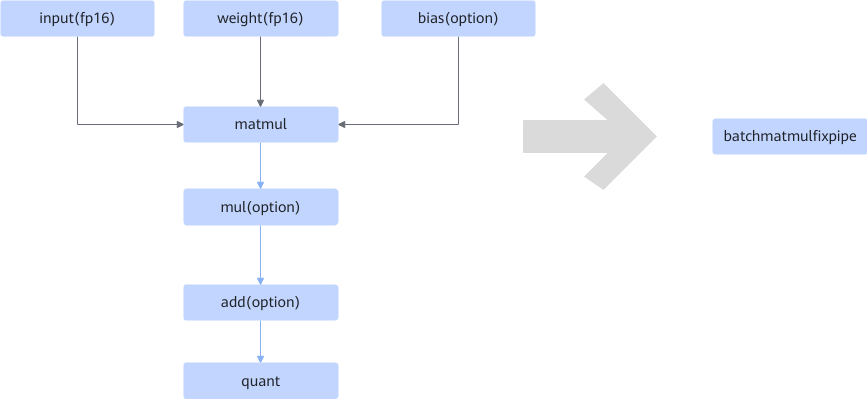

# BatchMatmulFixpipeFusionPass

## Description

In quantization use cases, fuses the structure shown in the following figure into the BatchMatmulFixpipe operator, and uses Fixpipe to enable quantization.

## Constraints

None

## Applicable Products

<!-- npu="910b" id1 -->
Atlas A2 training products/Atlas A2 inference products
<!-- end id1 -->

<!-- npu="A3" id2 -->
Atlas A3 training products/Atlas A3 inference products
<!-- end id2 -->
