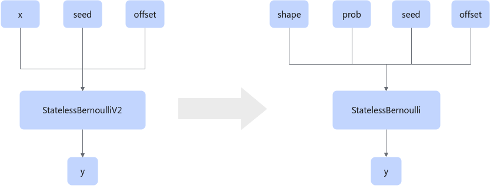

# BernoulliFusionPass

## Description

In GE, if prob has multiple values, the shape of x in StatelessBernoulliV2 is associated with the first input shape of StatelessBernoulli, and the value of x is associated with the second input prob, enabling unified online build adaptation.

## Constraints

The nodes and descriptions of the StatelessBernoulliV2 and StatelessBernoulli operators are not empty.

StatelessBernoulliV2: The input dimension is greater than or equal to 2.

## Applicable Products

<!-- npu="950" id1 -->
950PR/950DT
<!-- end id1 -->
