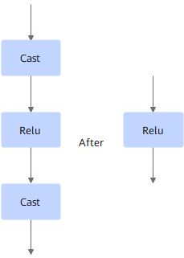

# CastReluCastFusionPass

## Description

Fuses the Cast+Relu+Cast operators into the Relu operator, that is, removes the Cast operators before and after Relu.

## Constraints

The data type of ReLU is fp32. The input data type of the front cast must be the same as the output data type of the rear cast, such as converting both from fp16 to fp32 or fp32 to fp16.
