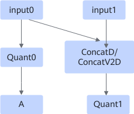
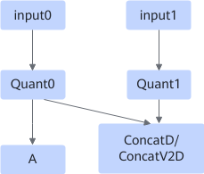
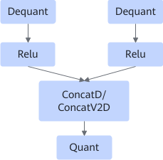
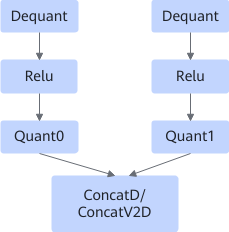
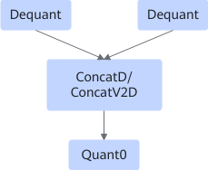
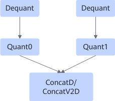

# ConcatQuantFusionPass

## Description

Fuses the ConcatD/ConcatV2D+Quant subgraph into the Quant+ConcatD/ConcatV2D subgraph. The fusion patterns can reduce the amount of data to be moved and improve computing performance.

After:

Or

After:

Or

After:

## Constraints

- In the first figure, the parameters of Quant0 and Quant1 must be the same.
- During data comparison, the corresponding fusion pattern needs to be disabled.
- This fusion pattern is not supported when the data type of the current Quant output is int4.
- The output node of Concat does not support the stridedwrite operator.
- If Fixpipe is supported, ReLU can be Leaky ReLU, PReLU, ReLU6, or ReLU.
<!-- npu="910b,910,310p,310b" id1 -->
- The fused axis is the C axis when the input format of Concat is NCHW and `concat_dim_` is 1 or -3, or when the input format of Concat is NHWC and `concat_dim_` is 3 or -1. In this case, the value of the C axis must be an integer multiple of K0. The shape value must meet the following conditions:

    K0 = 16 for the float16/float32 data type; K0 = 32 for the int8 data type; K0 = 64 for the int4 data type. This constraint applies to the products running with the following chip types:

    <!-- npu="910" id2 -->
    - Atlas training products
    <!-- end id2 -->
    <!-- npu="310p" id3 -->
    - Atlas inference products
    <!-- end id3 -->
    <!-- npu="910b" id4 -->
    - Atlas A2 training products/Atlas A2 inference products
    <!-- end id4 -->
    <!-- npu="310b" id5 -->
    - Atlas 200I/500 A2 inference products
    <!-- end id5 -->
<!-- end id1 -->
