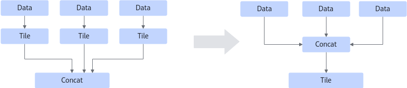
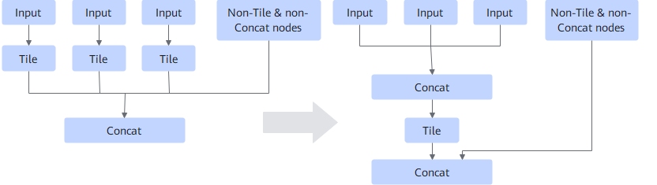

# ConcatTileFusionPass

## Description

Concatenates multiple identical contiguous inputs to fuse Tile operators.

**Pattern 1**

**Model 2**

## Constraints

- Only Tile/TileD+Concat operators are supported.
- Concat[ConcatD/ConcatV2/ConcatV2D] and Tile/TileD support only one output.
- `concat_dim` of Concat cannot be the same as the broadcast axis of Tile/TileD.
- Concat supports only data edges. Control edges can exist only in the input of Tile nodes.
- Only static scenarios are supported.
- The multiple inputs of Tile/TileD must be the same and contiguous in Concat. The number of contiguous Tile/TileD must be greater than 2.
- The product of the input tensor shape dimensions of Tile/TileD must be less than or equal to `shape_limited_`.

    `shape_limited_ = vector_calculate_size * 2 * vector_core_num/data_type_size`

    `data_type_size` indicates the data size of the output tensor of Concat[ConcatD/ConcatV2/ConcatV2D].

    To view the values of `vector_calculate_size` and `vector_core_num`, perform the following steps:

    View the platform information file in the `${INSTALL_DIR}/${arch}/data/platform_config` folder and search for the keyword `vec_calc_size` or `vector_core_cnt` to obtain the values of `vector_calculate_size` and `vector_core_num`. Replace `${INSTALL_DIR}` with the actual file storage path after the CANN software is installed. For example, if the installation is performed as the `root` user, the default file storage path after the installation is `/usr/local/Ascend/cann`.

## Applicable Products

<!-- npu="310p" id1 -->
Atlas inference products
<!-- end id1 -->

<!-- npu="310b" id2 -->
Atlas 200I/500 A2 inference products
<!-- end id2 -->

<!-- npu="910" id3 -->
Atlas training products
<!-- end id3 -->

<!-- npu="910b" id4 -->
Atlas A2 training products/Atlas A2 inference products
<!-- end id4 -->

<!-- npu="A3" id5 -->
Atlas A3 training series products and Atlas A3 inference series products
<!-- end id5 -->
