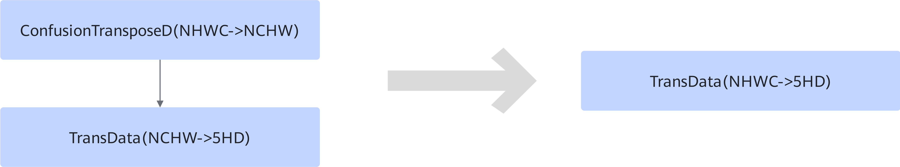

# ConfusionTransposeTransDataFusionPass 

## Description

Fuses ConfusionTransposeD(NHWC->NCHW) and TransData(NCHW->5HD) into the TransData(NHWC->5HD) operator to reduce one ConfusionTransposeD operation during the graph fusion phase.

## Constraints

- Only static subgraphs are supported.
- Only the ConfusionTransposeD(NHWC->NCHW) + TransData(NCHW->5HD) scenario is supported.
