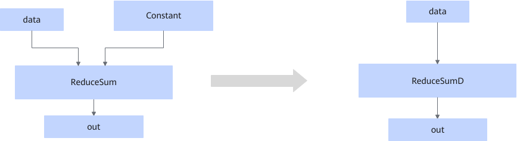

# ConstToAttrReduceSumFusion

## Description

Changes the ReduceSum operator that fits the graph fusion pattern to the ReduceSumD operator in static scenarios.

## Constraints

- The input data type can only be float16, float32, or bfloat16.
- The fusion pattern does not take effect when the axis is an empty tensor.
- The fusion pattern does not take effect in dynamic scenarios.
- This fusion pattern is enabled by default and cannot be disabled.

## Applicable Products

<!-- npu="910b" id1 -->
Atlas A2 training products/Atlas A2 inference products
<!-- end id1 -->
