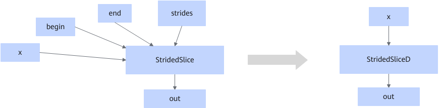

# ConstToAttrStridedSliceFusion

## Description

Fuses the StridedSlice operator into the StridedSliceD operator, and converts StridedSlice's Const node inputs (begin, end, and strides) into attributes of StridedSliceD.

## Constraints

- This fusion pattern does not take effect when the scenario involves dynamic shapes and the StridedSlice operator is supported on the corresponding platform.
- The fusion pattern does not take effect when the output shape contains `0`.
- The fusion pattern does not take effect when the begin, end, and strides inputs of StridedSlice are not Const nodes.
- The fusion pattern does not take effect when the StridedSliceD operator is not supported on the platform.
- The fusion pattern does not take effect when the tail axis of strides is less than 1.
- If the attributes `new_axis_mask`, `shrink_axis_mask`, `begin_mask`, `end_mask`, and `ellipsis_mask` are missing, the fusion pattern does not take effect.
- The fusion pattern does not take effect when `begin_mask` is `0` and all other attributes are not `0`.
- The fusion pattern does not take effect when the data type is not supported by the fused operator.

## Applicable Products

<!-- npu="910b" id1 -->
Atlas A2 training products/Atlas A2 inference products
<!-- end id1 -->
