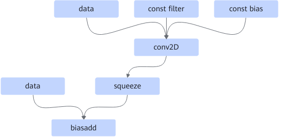
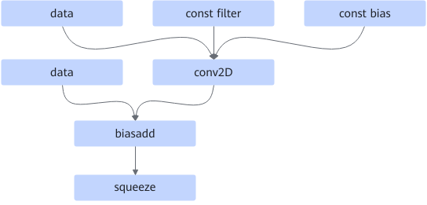

# Conv2DSqueezeBiasaddFusionPass

## Description

Converts the conv2D+squeeze+biasadd operators into the conv2D+biasadd+squeeze operators.

Before:  After:

## Constraints

- The data node input to the biasadd node must be 1-dimensional. Otherwise, an error is reported.
- The input node to the biasadd node must be data. If it is a Variable node instead, fusion fails.
- For the biasadd node, both of its inputs must have static shapes. Otherwise, the fusion will not be applied.
- For the biasadd node, the second input must be 1-dimensional. Otherwise, the fusion will not be applied.
- No fusion is performed in the training scenario.

## Applicable Products

<!-- npu="310p" id1 -->
Atlas inference products
<!-- end id1 -->

<!-- npu="310b" id2 -->
Atlas 200I/500 A2 inference products
<!-- end id2 -->

<!-- npu="910" id3 -->
Atlas training products
<!-- end id3 -->

<!-- npu="910b" id4 -->
Atlas A2 training products/Atlas A2 inference products
<!-- end id4 -->

<!-- npu="A3" id5 -->
Atlas A3 training products/Atlas A3 inference products
<!-- end id5 -->

<!-- npu="950" id7 -->
950PR/950DT
<!-- end id7 -->
