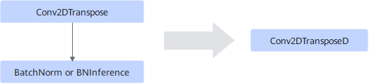

# Conv2DTransposeBatchnormFusionPass

## Description

Fuses the Conv2DTranspose+BatchNorm/BNInference operators into the Conv2DTransposeD operator, that is, converts the input of BatchNorm or BNInference into the weight and bias inputs of Conv2DTransposeD.

## Constraints

- The `groups` attribute of Conv2DTranspose must be set to `1`.
- The input type (except input x) of BatchNorm or BNInference must be const.
- Only static scenarios are supported.
- The BatchNorm operator supports only four dimensions.
