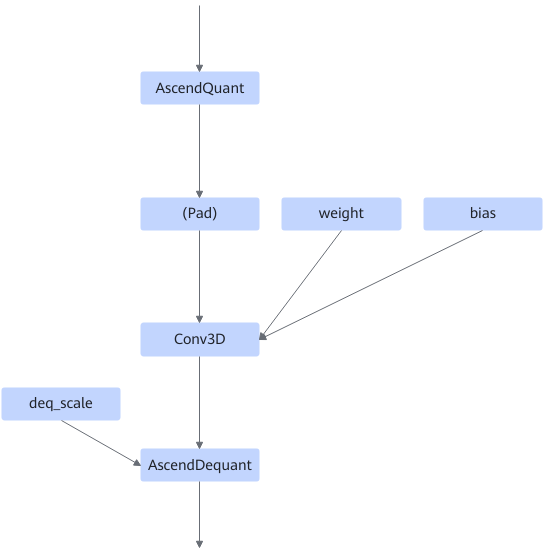
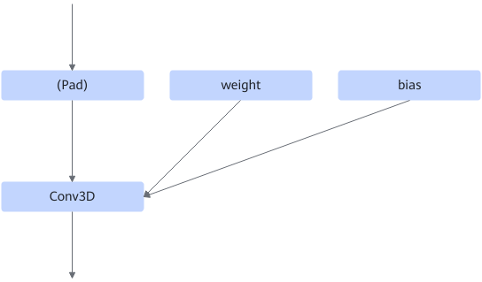

# Conv3DQuantProcessFusionPass

## Description

Performs unquantization or bias optimization in the case of static shapes.

- Bias optimization: When the c0 value of AscendQuant is greater than that of fp16 or Conv3D does not support the fp16 format, bias optimization is performed. Otherwise, unquantization is performed. For bias optimization, the graph structure does not need to be modified.
- During unquantization, constant folding operators are inserted to eliminate AscendQuant and AscendDequant operators. For details, see the following figures.

After: (unquantization)

## Constraints

None
