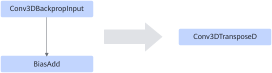

# Conv3DbpInputBiasAddFusionPass

## Description

Fuses the Conv3DBackpropInput+BiasAdd operators into the Conv3DTransposeD operator. The BiasAdd input is used as the input bias of Conv3DTransposeD.

## Constraints

The output format of the Conv3DTransposeD operator is FLOAT16.
