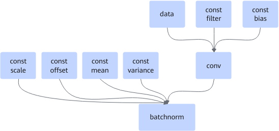

# ConvBatchnormFusionPass

## Description

Fuses the Conv2d+batchnorm or Conv3d+batchnorm operators into one operator; or fuses the DepthwiseConv2d+batchnorm operators into one operator when batchnorm has two inputs.

After:

## Constraints

- The conv node can be Conv2D or Conv3D. When the batchnorm node has only two inputs (mean and variance), the conv node can also be DepthwiseConv2D.
- The batchnorm node can be batchnorm or BNInference.
- The filter and bias nodes must be of const type. If the filter node is QuantWeightRollBack, fusion fails.
- The batchnorm node can have two inputs (mean and variance) or four inputs (as shown in the preceding figure). All inputs must be of const type. Otherwise, fusion fails.
- When the data node has dynamic inputs, fusion is supported.
- When the conv node has dynamic weight inputs, fusion does not apply.

## Applicable Products

<!-- npu="310p" id1 -->
Atlas inference products
<!-- end id1 -->

<!-- npu="310b" id2 -->
Atlas 200I/500 A2 inference products
<!-- end id2 -->

<!-- npu="910" id3 -->
Atlas training products
<!-- end id3 -->
