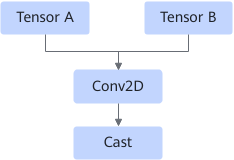
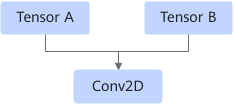
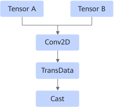
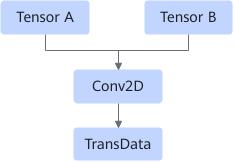

# ConvCastFusionPass

## Description

Fuses the Conv2D operator and Cast operator into one Conv2D operator.

After:

or

After:

## Constraints

- This fusion takes effect when the input data type of Conv2D is float16 and the output data type of Cast is float32.
- When the Conv2D or Cast node is dynamic, fusion is not performed.
- When the Conv2D input node has StridedRead, fusion is not performed.
- When the number of Conv2D output nodes is greater than 1, fusion is not performed.

## Applicable Products

<!-- npu="310p" id1 -->
Atlas inference products
<!-- end id1 -->

<!-- npu="310b" id2 -->
Atlas 200I/500 A2 inference products
<!-- end id2 -->

<!-- npu="910" id3 -->
Atlas training products
<!-- end id3 -->
