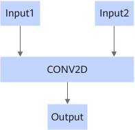

# ConvFormatRefreshFusionPass

## Description

For the structure below, configures the shape and format of the CONV2D operator's Input1 to match those of Output.

## Constraints

The fusion pattern takes effect when the following conditions are met:

- The original format of Input1 must be consistent with that of Output, or the original shape dimensions of Input1 must be consistent with those of Output.
- If the output format is 5HD and a C0 value exists, the C0 value of Input1 for the convolution operator must be consistent with that of Output.
- When the format of Input1 is not consistent with that of Output, the output format is restricted to NCHW, NHWC, HWCN, CHWN, or NC1HWC0.

## Applicable Products

<!-- npu="310b" id1 -->
Atlas 200I/500 A2 inference products
<!-- end id1 -->

<!-- npu="310p" id2 -->
Atlas inference products
<!-- end id2 -->

<!-- npu="910" id3 -->
Atlas training products
<!-- end id3 -->

<!-- npu="910b" id4 -->
Atlas A2 training products/Atlas A2 inference products
<!-- end id4 -->

<!-- npu="A3" id5 -->
Atlas A3 training products/Atlas A3 inference products
<!-- end id5 -->

<!-- npu="950" id6 -->
950PR/950DT
<!-- end id6 -->
