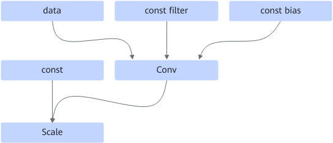
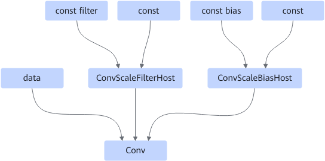

# ConvScaleFusionPass

## Description

Fuses the conv and scale operators into the conv operator, replaces the filter input with the ConvScaleFilterHost operator, and replaces the bias input with the ConvScaleBiasHost operator to improve computing performance.

After:

## Constraints

- Dynamic scenarios are not supported.
- The filter input of the conv operator cannot be QuantWeightRollBack.
- The conv operator cannot have multiple outputs.
- The other input of the filter, bias, and scale nodes must be const.

## Applicable Products

<!-- npu="310p" id1 -->
Atlas inference products
<!-- end id1 -->

<!-- npu="310b" id2 -->
Atlas 200I/500 A2 inference products
<!-- end id2 -->

<!-- npu="910" id3 -->
Atlas training products
<!-- end id3 -->
