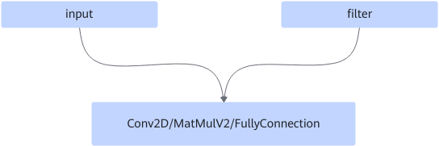
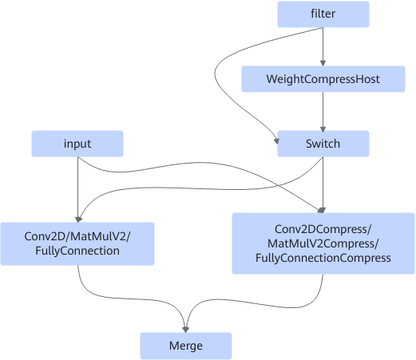

# ConvWeightCompressFusionPass

## Description

For Cube operators, the filter is compressed by inserting a compression operator or sparsified by inserting a 2:4 structured sparsity operator. This pass performs compression or 2:4 structured sparsity based on the user-defined parameters.

Cube operators support Conv2D, FullyConnection, and MatMulV2.

After:

## Constraints

The first node (Conv2D/FullyConnection/MatMulV2) must meet the following conditions:

- The data type of the input with index 0 must be int8 or uint8.
- AI Core must be supported.
- The value of groups must not be greater than 1.
- Weight compression or 2:4 structured sparsity must be supported.

## Applicable Products

The validity of the pass depends on whether the target product supports the corresponding operator type. For details, see [Ascend IR Operator Specifications](https://www.hiascend.com/document/detail/en/CANNCommunityEdition/latest/API/aolapi/operatorlist_00094.html) in the operator library.
