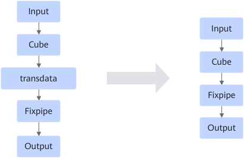

# CubeTransFixpipeFusionPass

## Description

Moves transdata downward to fuse with Fixpipe when the following structure is matched.

## Constraints

- Only static scenarios are supported.
- The Cube operator must have FixpipeAbility configured. For details, see [FixPipeAbilityProcessPass](FixPipeAbilityProcessPass.md).
- The data type of the Cube node must be float32.

## Applicable Products

<!-- npu="910b" id1 -->
Atlas A2 training products/Atlas A2 inference products
<!-- end id1 -->
