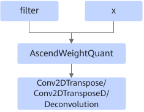
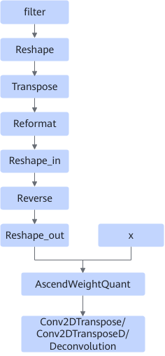

# DeconvWeightTransFusionPass

## Description

Transposes the input filter in reverse order in the int8 quantization scenario.

After:

- If filter is not 4-dimensional, the `complement_dimension` node is inserted after filter.
- When the H and W dimensions in the shape of filter are both not 1, the `reshape_in`, `reverse`, and `reshape_out` nodes are inserted in sequence after Reformat.
- Constant folding is performed on all inserted nodes.

## Constraints

- This fusion takes effect in the int8 quantization scenario.
- The filter input of AscendWeightQuant supports only const and int8 type.
